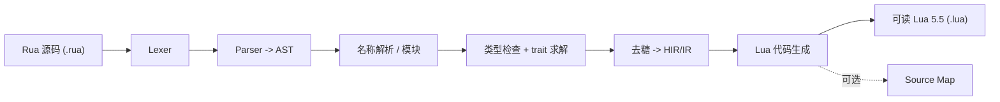

# Rua 语言设计文档

> 状态：设计草案 (Draft)。工作代号 **Rua**（**Ru**st + L**ua**）。
> 编译器实现（建议）：`crates/moon-ruac`（CLI 名 `ruac`）。
> 目标运行时：moon_rs 内置的 **PUC Lua 5.5.0**（见 `crates/moon-base/lua55/`）。

Rua 是一门 **Rust 语法子集**的**静态类型**脚本语言。它由一个 Rust 实现的编译器**转译为可读的 Lua 5.5 源码**，再交给 moon_rs 现有的 Lua VM（`luaL_loadfile` 路径）编译执行。

三条基调（已定）：

- **后端形态**：转译为 Lua 5.5 **源码**（非直接产字节码）。moon_rs 目前所有脚本都是运行时 `luaL_loadfile` 编译加载，产源码天然融入，且不与 Lua 字节码版本强绑定、生成物可读可调试。
- **语言规模**：中等子集 —— Rust 风格语法 + **静态类型检查** + `trait`/`impl` + 泛型；**不做**所有权 / 借用 / 生命周期检查。
- **定位**：通用脚本语言，Lua 仅作执行后端，不与 moon_rs 强绑定；但可选提供 `moon.*` 的类型声明便于写 actor 逻辑。

一句话概括：**写起来像 Rust，跑起来是 Lua，编译期帮你挡住大部分类型错误。**

---

## 1. 设计目标与原则

| 原则 | 含义 |
|---|---|
| **可读的产物** | 生成的 Lua 必须像手写代码：变量名保留、缩进正常、无 IIFE 噪音。方便调试与代码审查。 |
| **零额外运行时** | 不引入自研 VM、不捆绑重运行时。生成的 `.lua` 只依赖标准 Lua + 一个极小的 `rua_rt` 运行时垫片（`Option`/`Result`/枚举构造等）。 |
| **静态兜底，动态执行** | 编译期做类型检查、trait 求解、名称解析；运行期沿用 Lua 的动态语义。类型信息在代码生成时**擦除**。 |
| **语法即 Rust 子集** | 合法的 Rua 程序应当能被 `rustfmt` 格式化、被 Rust 语法高亮识别。降低学习成本，允许复用 Rust 工具。 |
| **渐进式** | 分阶段落地（见 §8），每阶段都能端到端跑通一个可用子集。 |

### 非目标

- **借用检查 / 生命周期 / 所有权**：不追踪 `&`、`&mut`、移动语义。`&T` 在类型层面接受但退化为普通引用（Lua 表本就是引用语义）。
- **单态化**：泛型走类型擦除，不为每个具体类型生成副本（Lua 是动态类型，无需要）。
- **`unsafe` / 裸指针 / 内联汇编 / FFI-to-C**。
- **宏系统**（`macro_rules!`、过程宏）—— 至多保留少量内建“宏形态”函数（如 `println!`、`vec!`、`format!`）当作语法糖。
- **完整标准库对齐**：只提供一个精选的 `std` 垫片（见 §6），不追求与 Rust std 一一对应。

---

## 2. 编译器管线



各阶段职责：

| 阶段 | 输入 → 输出 | 职责 |
|---|---|---|
| **Lexer** | 字符流 → token 流 | 分词、记录 span（行列），供报错定位 |
| **Parser** | token → AST | 构建抽象语法树，语法错误报告 |
| **Resolve** | AST → 带绑定的 AST | 解析 `use`/模块路径、变量作用域、把标识符绑定到定义 |
| **Typeck** | → 带类型标注的 AST | 双向类型推断、trait 约束求解、方法解析、可变性检查 |
| **Lower** | AST → HIR | 去糖：`for`→迭代器循环、`?`→提前返回、`if let`→`match`、运算符→trait 方法调用、闭包捕获显式化 |
| **Codegen** | HIR → Lua 文本 | 生成可读 Lua，管理临时变量与作用域，发射 `require "rua_rt"` |

- **编译器语言**：Rust（贴合本仓 workspace，`edition = 2024`）。
- **建议落地形态**：新增 crate `crates/moon-ruac`，产出 CLI `ruac`；`rua_rt` 运行时垫片作为一个 `.lua` 文件随生成物一起分发（放 `lualib/rua_rt.lua`）。

### 2.1 Parser：手写递归下降，参考 lua-rs

**决定：手写词法 + 递归下降解析器**，架构直接参考同作者的 [`lua-rs`](https://github.com/) 项目里成熟的 Lua parser（`crates/luars/src/compiler/parser/`），把其中已验证的分层结构照搬到 Rua（把 Lua 语法换成 Rust 子集语法即可）。

为什么不用 `syn`：`syn` 覆盖**全量** Rust，需要额外维护一个庞大的“子集校验器”去逐一拒绝不支持的构造，且报错术语偏 Rust；而 lua-rs 已经证明手写 parser 在本类项目里可控、可给出贴合的诊断、便于裁剪语法。手写路线让 Rua 从一开始就只接受它想接受的语法。

**借鉴 lua-rs 的分层结构：**

| lua-rs 组件 | 文件 | Rua 对应 |
|---|---|---|
| `Reader` | `parser/reader.rs` | 字符流读取器：`current_char` / `bump` / `eat_while` / 缓冲区 + `SourceRange` |
| `Tokenize` | `parser/lua_tokenize.rs` | 词法器 `RuaTokenize`：`next_token_data()` 逐个产 token，跳过空白/注释，处理字符串/数字/转义 |
| `TokenKind` | `parser/lua_token_kind.rs` | `RuaTokenKind` 枚举 + `to_user_string()`（改为 Rust 关键字/符号：`fn`/`let`/`match`/`->`/`::`/`=>` 等） |
| `Lexer`（双 token 前瞻） | `parser/mod.rs` `LuaLexer` | `RuaLexer`：持有 `current` + `next` 两个 token，`bump()` 前移、`peek_next_token()` 前瞻、记录 `line`/`lastline`/嵌套深度 |
| 表达式解析（优先级爬升） | `expr_parser.rs` `subexpr` | Rua 表达式解析：`subexpr(limit)` 优先级爬升 + 一元/二元优先级表（Rust 运算符优先级），处理 `.`/`::`/方法调用/索引/`?` 后缀 |
| 语句解析 | `statement.rs` | Rua item/stmt 解析：`fn`/`struct`/`enum`/`trait`/`impl`/`let`/`if`/`match`/`loop`/`for`/`while` |

**关键手法（沿用 lua-rs）：** 双 token 前瞻（`current`/`next`）足以解析 Rust 子集；表达式用**优先级爬升**（`subexpr` 带 `limit` 参数，参考 `expr_parser.rs:51` 的 `subexpr`）；每个 token 带 `SourceRange`（行列 span）用于诊断；词法错误就地记录并以 `Result<_, String>` 冒泡。

**与 lua-rs 的差异（Rust 子集特有）：** 需新增 token —— `->`、`=>`、`::`、`&`/`&mut`、泛型 `<...>`（注意与 `<`/`>` 比较运算的消歧，用有界前瞻 + 上下文判断）、属性 `#[...]`、生命周期 `'a`（词法接受、语义拒绝）、闭包 `|...|`、范围 `..`/`..=`。关键字集合换成 Rust 的（`fn let mut struct enum trait impl match if else loop while for in return pub use mod as where self Self true false`）。

---

## 3. 语言特性子集

以下为**目标全集**；分阶段落地见 §8。

### 3.1 类型

| Rua 类型 | 说明 | Lua 表示（见 §4） |
|---|---|---|
| `i64` | 有符号整数 | Lua integer 子类型 |
| `f64` | 浮点 | Lua float 子类型 |
| `bool` | 布尔 | `boolean` |
| `char` | 单字符 | 长度为 1 的 `string` |
| `String` / `&str` | 字符串（不区分所有权） | `string`（不可变，符合 Lua 语义） |
| `()` | 单元类型 | `nil` / 无返回值 |
| `(A, B, ...)` | 元组 | 数组式 table `{a, b}` |
| `[T; N]` / `Vec<T>` | 定长数组 / 动态数组 | **0-based** 数组 table + `n` 长度约定（对齐 Rust 下标；由 `rt.vec` 挂元表） |
| `HashMap<K,V>` | 映射 | table |
| `Option<T>` | 可空 | 纯 nil：`Some(v)`→`v`，`None`→`nil`（见 §4.3） |
| `Result<T,E>` | 结果 | `{ ok = ... }` / `{ err = ... }` |
| `struct` | 记录 | table + 元表 |
| `enum` | 标签联合 | `{ tag = "...", ... }` |
| `fn(A)->B` | 函数类型 | `function` |

数值类型 MVP 只保留 `i64` / `f64`（Lua 原生两种数值子类型）；`i32`/`u32`/... 作为别名映射到 `i64` 并在类型层面提示（不做真实位宽/无符号语义）。

### 3.2 变量与绑定

- `let x = expr;` / `let mut x = expr;`
- 变量遮蔽（shadowing）合法。
- 可变性：`let`（不可变）在编译期禁止再赋值；`let mut` 允许。这是编译期检查，Lua 侧无区别。
- 解构绑定：`let (a, b) = pair;`、`let Point { x, y } = p;`

### 3.3 函数

- `fn name(a: T, b: U) -> R { ... }`
- 闭包：`|a, b| expr` / `move |a| { ... }`（`move` 仅语义标注，Lua 闭包本就按引用捕获 upvalue）。
- 泛型函数：`fn map<T, U>(v: Vec<T>, f: fn(T)->U) -> Vec<U>`（类型擦除）。
- 默认返回 `()`；块尾表达式即返回值（表达式导向，见 §4.1）。

### 3.4 控制流

- `if cond { } else if { } else { }`（可作表达式取值）
- `match expr { pat => ..., _ => ... }`（含字面量、绑定、结构体/枚举、`|` 或模式、`if` guard、范围 `1..=5`）
- `loop { }` / `while cond { }` / `for x in iter { }`
- `break` / `continue`，含标签 `'outer: loop { break 'outer; }`
- `loop` 可 `break value;` 取值

### 3.5 struct / enum / trait / impl

```rust
struct Point { x: f64, y: f64 }

enum Shape {
    Circle(f64),
    Rect { w: f64, h: f64 },
    Unit,
}

trait Area {
    fn area(&self) -> f64;
    fn name(&self) -> String { "shape".to_string() } // 默认方法
}

impl Area for Shape {
    fn area(&self) -> f64 {
        match self {
            Shape::Circle(r) => 3.14159 * r * r,
            Shape::Rect { w, h } => w * h,
            Shape::Unit => 0.0,
        }
    }
}
```

- `impl Type { ... }`（固有方法）与 `impl Trait for Type { ... }`。
- 方法 receiver：`self` / `&self` / `&mut self`（均映射为第一参数，可变性仅编译期检查）。
- 关联函数：`Type::new(...)`。
- 运算符重载：`impl Add for T` → 生成对应元方法（见 §4.5）。

### 3.6 模块与可见性

- `mod foo { ... }` 与文件模块（`foo.rua`）。
- `use path::to::Item;`
- `pub` / 私有：编译期可见性检查；私有项不写入模块导出表。
- 每个模块编译为一个 Lua 文件，`return` 一个导出 table（见 §4.7）。

### 3.7 错误处理

- `Result<T, E>` + `?` 运算符（`?` 去糖为“出错即提前返回 `Err`”）。
- `panic!(msg)` → Lua `error(msg)`；不可恢复。
- 不提供 `catch_unwind`；如需捕获交给 Lua 侧 `pcall`（通过互操作，见 §6）。

---

## 4. 代码生成决策（核心）

本节是设计的重心：如何把 Rust 语义**可读地**映射到 Lua。所有示例左为 Rua，右为生成 Lua。

### 4.1 表达式导向 → 语句导向：临时变量提升

Rust 一切皆表达式；Lua 的 `if`/`while`/块不产值。策略：**当块/`if`/`match`/`loop` 处于取值位置时，提升一个临时变量 `__t`，在各分支尾部对它赋值**（而非包一层立即调用函数 IIFE —— 后者可读性差且有闭包开销）。

```rust
let y = if x > 0 { x } else { -x };
```

```lua
local __t1
if x > 0 then
  __t1 = x
else
  __t1 = -x
end
local y = __t1
```

当 `if` 处于语句位置（不取值），直接生成普通 `if`，不引入临时变量。块表达式同理：内部语句照常发射，块尾表达式赋给外层临时变量。

### 4.2 数据映射对照表

| Rua | Lua 运行期表示 | 备注 |
|---|---|---|
| `struct P { x, y }` | `{ x = .., y = .. }` + 元表（方法在 `__index`） | 字段直存 |
| 元组 `(a, b)` | `{ a, b }` | 1-based |
| `Vec<T>` / `[T; N]` | `rt.vec({ [0]=.., [1]=.., n = len })` | **0-based**（对齐 Rust `v[i]`）；用 `n` 记长度，规避 `nil` 空洞；迭代用 `n` 而非 `#` |
| `HashMap<K,V>` | `rt.map()` → `{ d = {..}, n = len }` + 元表 | 数据存 `d` 子表（避免键与方法名冲突）；`n` 记条目数；方法 `insert/get/remove/contains_key/len` |
| `enum` 变体 | `{ tag = "Variant", ... }` | 见 §4.4 |
| `Option<T>` | `Some(v)`→`v`；`None`→`nil`（纯 nil，禁止嵌套/容器内 Option） | 见 §4.3 |
| `Result<T,E>` | `{ ok = v }` / `{ err = e }` | `?`/`match` 分派 |

### 4.3 `Option` 与 `nil`（纯 nil 方案，已定）

Lua 的 `nil` 兼作“空”和“不存在”。Rua **采用纯 `nil` 方案**，生成物最干净：

- `Some(v)` → `v`（无包装）
- `None` → `nil`

```rust
let a: Option<i64> = Some(3);
let b: Option<i64> = None;
```

```lua
local a = 3
local b = nil
```

**代价 —— 编译期禁止会与 `nil` 语义冲突的用法**（`ruac` 直接报错，引导改写）：

- `Option<Option<T>>` 嵌套（`Some(None)` 与 `None` 不可区分）。
- 容器内的 `Option`：`Vec<Option<T>>` / `HashMap<K, Option<V>>`（`nil` 在数组中会造成空洞、在表中等价于删除键）。

`match`/`if let` 对 `Option` 编译为 `nil` 判定，而非 `tag` 判定：

```rust
match opt {
    Some(x) => use_it(x),
    None => fallback(),
}
```

```lua
if opt ~= nil then
  local x = opt
  use_it(x)
else
  fallback()
end
```

`?` 作用于 `Option` 时：`let x = opt?;` → `if opt == nil then return nil end; local x = opt`。

> 注意：这与 §4.4 的**普通 `enum`** 表示（`{ tag = "..." }`）是两套机制 —— `Option` 是被特殊处理的内建类型，用裸值 / `nil`；用户自定义 `enum` 仍用 `tag`。`Result` 也不受影响，仍用 `{ ok } / { err }`（见 §4.8），因为它要携带 `Err` 负载且不能塌缩成 `nil`。

### 4.4 enum 与 match

```rust
enum Shape { Circle(f64), Rect { w: f64, h: f64 }, Unit }
```

构造：

```lua
-- Shape::Circle(r)
{ tag = "Circle", [1] = r }
-- Shape::Rect { w, h }
{ tag = "Rect", w = w, h = h }
-- Shape::Unit
{ tag = "Unit" }
```

`match` 编译为按 `tag` 分派的 `if/elseif` 链（分支多且为字面量时可退化为查表分派）：

```rust
match s {
    Shape::Circle(r) => area1(r),
    Shape::Rect { w, h } => w * h,
    _ => 0.0,
}
```

```lua
local __t
if s.tag == "Circle" then
  local r = s[1]
  __t = area1(r)
elseif s.tag == "Rect" then
  local w, h = s.w, s.h
  __t = w * h
else
  __t = 0.0
end
```

模式匹配要素：字面量、通配 `_`、绑定、结构体/枚举解构、`|` 或模式（合并 `elseif` 条件）、`if` guard（附加 `and cond`）、范围 `a..=b`（`x >= a and x <= b`）。编译期做**穷尽性检查**（缺分支且无 `_` 报错）。

**`if let` / `while let`（P4c-0）** 复用同一套模式测试/绑定（`pat_test`），是 `match` 的轻量分支/循环形式：

```rust
if let Some(x) = find(v, k) {   // 取值型：可带 else、可作表达式尾值
    use_it(x);
} else {
    fallback();
}

while let Some(x) = stack.pop() {   // 循环型：pop 返回 None 时退出
    handle(x);
}
```

```lua
-- if let（Option 走纯 nil；Result 走 .ok/.err；enum 走 .tag）
local __t = find(v, k)
if __t ~= nil then
  local x = __t
  use_it(x)
else
  fallback()
end

-- while let（else 分支 break 收尾，避免 match 的非穷尽错误分支）
while true do
  local __t = stack:pop()
  if __t ~= nil then
    local x = __t
    handle(x)
  else
    break
  end
  ::continue::
end
```

### 4.5 struct 方法与 trait 分派

固有方法与 trait 方法都放进类型的**元表 `__index`**；`&self` 调用编译为 `obj:method(...)`（Lua 冒号语法，自动传 `self`）。

```rust
impl Point {
    fn new(x: f64, y: f64) -> Point { Point { x, y } }
    fn norm(&self) -> f64 { (self.x*self.x + self.y*self.y).sqrt() }
}
```

```lua
local Point = {}
Point.__index = Point

function Point.new(x, y)
  return setmetatable({ x = x, y = y }, Point)
end

function Point:norm()
  return math.sqrt(self.x*self.x + self.y*self.y)
end
```

**trait 分派两种模式**：

- **静态分派（默认）**：接收者具体类型已知（`p.area()` 且 `p: Shape`）→ 直接生成 `p:area()`，零开销。泛型 `fn f<T: Area>(x: T)` 经擦除后也是直接方法调用（依赖 Lua 动态查找 `__index`）。
- **动态分派（`dyn Trait`）**：`Box<dyn Area>` / `&dyn Area` → 运行期靠对象自带的元表查方法，形态与静态相同（Lua 动态本就统一）。无需生成显式 vtable。

**运算符重载**：`impl Add for Vec2` → 生成 Lua 元方法 `Vec2.__add = function(a, b) ... end`。映射表：`Add→__add`、`Sub→__sub`、`Mul→__mul`、`Div→__div`、`Neg→__unm`、`Eq→__eq`、`PartialOrd→__lt/__le`、`Index→__index`（需与方法表协调）。

### 4.6 泛型：类型擦除

泛型只服务于**编译期类型检查**；代码生成时擦除所有类型参数，因为 Lua 动态派发。

```rust
fn first<T>(v: Vec<T>) -> Option<T> { ... }
```

生成的 Lua 与非泛型版本无差别 —— 没有 `first_i64` / `first_string` 之类单态化副本。trait 约束 `T: Area` 在编译期保证 `T` 有 `area` 方法，运行期直接 `x:area()`。

**已实现（P5c-4）**：声明处（`fn`/`struct`/`enum`/`trait`/`impl`）解析 `<T: A + B>` 并入 AST（`GenericParam { name, bounds }`）。两层检查：

- **结构检查器**校验每个约束 trait 存在——是已声明 trait，或内建白名单之一（`Clone`/`Copy`/`Debug`/`Display`/`Default`/`Eq`/`Ord`/`Hash`/`Add`/`Sub`/`Mul`/`Div`/`Rem`/`Neg`/`Iterator`/`From`/`Into`…）；否则报 `unknown trait ... in bound`。
- **类型检查器**引入 `Ty::Generic(name)`（视为非具体，`compatible` 恒真——零误报）。进入函数体时把该函数的泛型形参装入 `gen_bounds`，`ty_of` 把这些名字解析为 `Ty::Generic`。对**泛型接收者**的方法调用（`x.m(..)`，`x: T`）经 `T` 的 trait 约束在 `trait_methods` 中解析签名，检查元数与实参类型；约束未覆盖的方法保持 `Unknown`（静默，不误伤）。返回 `Self`/关联类型的 trait 方法其返回类型解析为 `Unknown`，天然安全。

例（`tests/fixtures/examples/example_rua_p5.rua`）：

```rust
trait Shape { fn area(&self) -> f64; fn name(&self) -> String; }
fn describe<T: Shape>(s: T) -> String {
    format!("{} area = {}", s.name(), s.area())  // 经 T: Shape 检查
}
```

擦除为单个 `function describe(s) return rt.format("{} area = {}", s:name(), s:area()) end`；`describe(circle)` / `describe(square)` 共用它，运行期靠各自元表的 `__index` 动态派发。

**已实现（P5c-5）**：

- **`where` 子句**：`fn f<T>(..) -> R where T: A + B { .. }`（`impl`/`struct`/`enum`/`trait` 同）——`where` 非关键字，解析器按标识符识别，把谓词合并进对应泛型形参的 bounds，故与内联 `<T: A + B>` 完全等价（结构检查、方法解析、调用点检查全部复用）。复杂左值（`T::Item: _`、`Vec<T>: _`）容忍解析但丢弃其约束（保守）。
- **调用点约束满足**：类型检查器记录 `impl Trait for Type`（type→trait 集）与 `FnSig.generics`。调用泛型自由函数时，用 `unify_generic` 从实参结构化推断类型实参（贯通 `Vec/Option/Result/HashMap`），逐条校验：**仅当**类型实参是**已知用户类型**（struct/enum）、约束是**用户声明的 trait**、且**无对应 impl** 才报 `type ... does not implement trait ...`；内建 trait、标量、`Unknown`、未绑定形参一律放过（零误报）。同时把类型实参代回返回类型（`subst_ty`），使 `id(1)` 推断为 `i64`。

```rust
struct Cat { n: i64 }
fn describe<T: Shape>(s: T) -> String { format!("{}", s.name()) }
describe(Cat { n: 1 });  // 报错：type `Cat` does not implement trait `Shape`
```

**已实现（P5c-6）**：**方法级泛型**同样入库并在调用点检查。方法的有效泛型 = `impl` 泛型 + 方法泛型；对具体类型接收者的 `x.m(args)`，从实参推断类型实参、校验其约束、并把实参代回返回类型（`obj.wrap(1) -> i64`）。impl 级泛型无法从不带实参的 `Ty::Named` 接收者恢复，故仅从实参推断（对约束检查仍可靠）。

```rust
struct Registry { n: i64 }
impl Registry { fn add<T: Shape>(&self, s: T) {} }
Registry { n: 0 }.add(Square { s: 1.0 });  // 报错：type `Square` does not implement trait `Shape`
```

**已实现（P5c-7）**：**trait 声明中的方法级泛型**也被保留并检查。trait 方法签名里把 trait 级与方法级泛型都当作抽象类型，方法级泛型存入签名；对**泛型接收者**（其类型经 trait 约束解析）调用该方法时，从实参推断方法级类型实参、校验约束、代回返回类型。结构检查器还会校验方法级约束里的 trait 是否存在。

```rust
trait Show { fn show(&self) -> String; }
trait Container { fn store<U: Show>(&self, x: U); }
struct Plain {}
fn use_it<T: Container>(c: T, p: Plain) { c.store(p); }  // 报错：type `Plain` does not implement trait `Show`（required by `Container::store`）
```

### 4.7 模块 → Lua 文件

```rust
// math_utils.rua
pub fn add(a: i64, b: i64) -> i64 { a + b }
fn secret() -> i64 { 42 }        // 私有，不导出
pub struct V2 { x: f64, y: f64 }
```

```lua
-- math_utils.lua
local M = {}
local rt = require("rua_rt")

local function secret() return 42 end     -- 私有，仅本文件可见

function M.add(a, b) return a + b end

local V2 = {}
V2.__index = V2
-- ... V2 构造/方法 ...
M.V2 = V2

return M
```

`use math_utils::add;` → `local add = require("math_utils").add`。与 moon_rs 现有 `require`/`package.path` 机制完全兼容。

> **已实现（P4c-1，切片 1，见路线图）**：目前支持的是**单文件内的内联 `mod`**（含嵌套），映射为**同文件的嵌套 `do` 块 + 表**，而非上面的多文件 `require` 方案（后者留待"余下"阶段）：
>
> ```rust
> mod math {
>     pub fn add(a: i64, b: i64) -> i64 { a + b }
>     pub fn double(x: i64) -> i64 { add(x, x) }   // 同模块兄弟调用
>     pub mod trig { pub fn triple(x: i64) -> i64 { x * 3 } }
> }
> use math::add;
> use math::trig::triple as tri;
> ```
>
> ```lua
> local main, math, add, tri
> math = {}
> do
>     local add, double, trig          -- 兄弟项为块内 local，彼此可见
>     function add(a, b) return (a + b) end
>     function double(x) return add(x, x) end
>     trig = {}
>     do
>         local triple
>         function triple(x) return (x * 3) end
>         trig.triple = triple
>     end
>     math.add = add; math.double = double; math.trig = trig
> end
> add = math.add                        -- use 别名（文件级 local，闭包按 upvalue 捕获）
> tri = math.trig.triple
> ```
>
> 跨模块访问用完全限定路径 `math::trig::triple` → `math.trig.triple`（复用既有 `::`→`.` 路径生成）。
>
> **P4c-2 追加**：模块内现已支持 `struct`/`enum`/`impl`/`trait`。类型的类表是 `do` 块内 local（`Point = {}; Point.__index = Point`），`impl` 方法就地生成 `function Point.new()`/`function Point:norm_sq()`，块尾 `mod.Point = Point` 发布。跨模块引用一律以限定路径的点式前缀作元表：
>
> ```rust
> mod geo {
>     pub struct Point { x: f64, y: f64 }
>     impl Point { pub fn new(x: f64, y: f64) -> Point { Point { x: x, y: y } } }
>     pub enum Shape { Circle(f64), Rect { w: f64, h: f64 }, Dot }
> }
> let p = geo::Point::new(3.0, 4.0);           // geo.Point.new(3.0, 4.0)
> let q = geo::Point { x: 1.0, y: 2.0 };       // setmetatable({...}, geo.Point)
> let s = geo::Shape::Circle(5.0);             // setmetatable({tag="Circle", 5.0}, geo.Shape)
> ```
>
> **P4c-3 追加**：`pub` 已强制可见性（跨模块访问私有项报错，见路线图 P4c-3）。
>
> **P4c-4 追加**：支持多文件 `mod name;`。解析后 `resolve.rs` 按 `dir/name.rua`（或 `dir/name/mod.rua`）定位文件、解析并把其 items 拼回该 `Mod` 节点，子模块再相对 `dir/name/` 递归解析；随后照常做检查/可见性/代码生成，**所有文件仍合并为单个 `.lua` 输出**（内联表方案）。CLI/`compile_path` 从文件目录起解析。示例见 `tests/fixtures/examples/rua_multi/`。
>
> **P4c-5 追加**：`use` 现由脱糖 pass（`resolve::resolve_uses`）处理——按词法作用域把别名替换为完全限定路径，遮蔽别名的局部量不改写。因此**不再有运行期别名 local**：`use m::f; f()` 直接生成 `m.f()`；`use` 可写在模块内（作用域限该模块）；导入私有项经可见性树报错。示例（`tests/fixtures/examples/rua_multi/math.rua`）：
>
> ```rust
> pub mod trig;
> use trig::triple;              // 模块内 use
> pub fn add_then_triple(a: i64, b: i64) -> i64 { triple(a + b) }
> ```
>
> 生成物中 `triple(a + b)` 脱糖为 `trig.triple((a + b))`（`trig` 为 `math` 的 `do` 块内 local）。
>
> **P4c-6 追加**：跨模块同名类型/枚举/函数/trait 现可共存——检查器对**跨作用域出现 2 次以上**的简单名去歧义（从注册表移除，相关检查降级为 `Unknown`，零误报）；codegen 本就用限定类表（`a.Point`/`b.Point`）在运行期区分。唯一命名的类型仍照常检查；被显式限定引用的同名类型暂不做字段/方法检查（保守）。
>
> **P5d 追加**：跨文件诊断已带文件归属——`SourceRange` 含 `file` id，多文件编译时子文件 AST 被打上文件 id，检查器经结构化 `Diag` 在末尾渲染为 `path:line: message`（单串编译回退为 `line: message`）。无 span 的诊断（重名、泛型约束、模式内可见性）暂仍为无位置消息。

### 4.8 `?`、panic、字符串格式化

- `x?` 去糖：

```rust
let v = may_fail()?;
```

```lua
local __r = may_fail()
if __r.err ~= nil then return __r end   -- 传播 Err
local v = __r.ok
```

- `panic!("boom {}", n)` → `error(rt.format("boom {}", n))`。
- `format!` / `println!` → `rt.format` / `print(rt.format(...))`；`{}` / `{:?}` 由 `rt.format` 在运行期按值类型渲染。

### 4.9 运行时垫片 `rua_rt`

一个小 Lua 模块（`lualib/rua_rt.lua`），集中放：`Some`/`None` 构造与判定、`Ok`/`Err`、`format`（`{}`/`{:?}` 渲染）、`vec`/数组辅助、迭代器协议辅助、`panic`。生成代码顶部 `local rt = require("rua_rt")`。保持**极小**，避免"重运行时"。

---

## 5. 类型系统

- **推断**：局部**双向类型推断**（bidirectional，与 Rust 局部推断风格一致）。函数签名必须显式标注参数与返回类型；函数体内 `let` 多数可省略标注。
- **名义类型**：`struct`/`enum` 按名字区分（nominal），不做结构化等价。
- **trait 求解**：为方法调用 / 运算符 / 泛型约束解析 `impl`。采用简化的一致性规则（coherence）：同一 `(Trait, Type)` 只允许一个 `impl`；孤儿规则简化为"`impl` 必须与 `trait` 或 `type` 定义在同一编译单元"。
- **泛型约束**：`fn f<T: Area + Clone>()` / `where` 子句；约束用于检查方法可用性，不生成代码。
- **可变性检查**：`let` vs `let mut`、`&self` vs `&mut self` 为纯编译期检查。
- **静态 vs 运行期边界**（明确划线）：

| 编译期保证 | 交给 Lua 运行期 |
|---|---|
| 类型匹配、方法存在、trait 满足 | 整数溢出（Lua 5.5 环绕语义） |
| 可变性、可见性、穷尽性匹配 | 数组越界（Lua 返回 `nil`） |
| 名称解析、arity（参数个数） | `HashMap` 缺键（返回 `nil`） |
| `Option`/`Result` 的解包安全（经 match/`?`） | 数值精度（`f64` 与 integer 混算） |

即：Rua 挡住"类型/结构"错误，但不改变 Lua 的数值与容器动态语义 —— 文档会明确提醒使用者这些差异。

---

## 6. Lua 互操作

Rua 要能调用现成 Lua 库（含 moon_rs 的 `moon.*`、`json`、`http` 等），也要能被 Lua 端调用。

### 6.1 调用 Lua：`extern` 声明

用带类型签名的声明块描述外部 Lua 符号，供类型检查，代码生成时直接映射为 Lua 全局/模块调用：

```rust
extern "lua" {
    // 映射到全局 print
    fn print(s: &str);
    // 映射到 require("json")
    mod json {
        fn encode(v: Any) -> String;
        fn decode(s: &str) -> Any;
    }
}
```

- 引入一个逃生类型 `Any`（对应 Lua 任意值），在互操作边界放宽检查。
- `mod json` → 生成 `local json = require("json")` 并按需引用。

### 6.2 类型声明文件（`.ruai`，类 `.d.ts`）

为大型 Lua 库（如 `moon`）提供独立声明文件 `moon.ruai`，只含签名不含实现；`ruac` 加载它做类型检查。可选随仓库提供 `moon.*` 的声明样例，让 Rua 顺手写 actor 逻辑（保持"通用语言"的同时给 moon 用户便利）。

> **已实现（P4c-7）**：`mod name;` 的解析器先找 `name.rua`/`name/mod.rua`，再回退到 `name.ruai`/`name/mod.ruai`。以 `.ruai` 载入的模块标记为**声明模块**（`ModDecl.is_decl`），且其嵌套模块递归继承该标记：
>
> - **检查器**照常登记其中的 `extern`/`struct`/`enum`/`trait`/`fn` 签名；
> - **代码生成完全跳过声明模块**——不生成 `local moon`，也不生成 `moon = {}`/`do ... end`；因此对 `moon::log(..)` 的引用降级为对宿主原生全局 `moon` 的 `moon.log(..)` 访问。
>
> 配套增加了**限定名函数调用检查**：所有自由函数与 `extern` 函数都以**全限定路径**登记进 `qual_fns`（如 `moon::log`、`a::b::f`），`use` 脱糖后的限定调用点即按其签名做元数/实参/泛型检查并回填返回类型（变参 `extern fn` 跳过元数检查）。全限定键天然唯一，故不受 P4c-6 简单名去歧义影响。
>
> 样例见 `tests/fixtures/examples/rua_moon/`（`main.rua` + `moon.ruai` + `run.lua` 宿主垫片，可用纯 Lua 5.5 运行）。声明块内的函数不进可见性树，`moon::log` 不会被误判为私有。

### 6.3 导出给 Lua

编译产物就是普通 Lua 模块（§4.7 的 `return M`），Lua 端 `require("your_module")` 即可用，无需任何桥接。struct/enum 值就是普通 table，字段可直接读。

---

## 7. 工具链与调试

- **CLI `ruac`**：
  - `ruac build file.rua` → `file.lua`
  - `ruac build src/ --out dist/` → 编译整个目录（模块树）
  - `--emit-sourcemap`、`--check`（只类型检查不产码）
- **Source Map（可选）**：生成 `file.lua.map`，把 Lua 行号映射回 `.rua`，配合 moon_rs 的 `lua_traceback`（`crates/moon-base/src/laux.rs`）把运行期栈回溯定位到 Rua 源。MVP 可先在生成 Lua 里插 `-- @rua file.rua:line` 注释做粗定位。
- **与 moon_rs 集成**：生成的 `.lua` 放进 `package.path` 覆盖的目录，服务照常 `luaL_loadfile` 加载，**运行时零改动**。可加一个 `cargo xtask ruac` 或构建步骤在启动前批量编译。
- **报错**：携带 span 的诊断（`file:line:col`）。每个 token 保留 `SourceRange`（参考 lua-rs 的 `SourceRange`），词法/语法/类型阶段均能精确定位。

---

## 8. 路线图（分阶段 MVP）

每个阶段都要求端到端可跑（Rua → Lua → moon_rs VM 执行）。

| 阶段 | 内容 | 状态 | 产出里程碑 |
|---|---|---|---|
| **P0 脚手架** | `crates/moon-ruac` crate、CLI 骨架、手写词法+parser 骨架（照搬 lua-rs 分层：Reader/Tokenize/Lexer）、`rua_rt.lua` 雏形 | ✅ 已完成 | `ruac build` 能跑通空/最简程序 |
| **P1 核心** | `fn`/`let`/基础表达式/`i64`/`f64`/`bool`/`String`/元组、`if`/`while`/`loop`、表达式→语句降级 | ✅ 已完成 | 能写并运行纯函数式脚本 |
| **P2 数据与匹配** | `struct`/`enum`/`match`/`Option`/`Result`/`?`、结构性检查 | ✅ 已完成 | 能写带数据结构与错误处理的程序 |
| **P3 抽象** | `trait`/`impl`/方法/默认方法/运算符重载、保守结构检查器 | ✅ 已完成（泛型见 P5c-4；完整双向类型检查器仍为保守版） | 真正的"静态类型 Rust 子集" |
| **P4a 迭代与集合** | `for x in iter`、范围 `a..b`/`a..=b`、索引 `v[i]`（0-based）、`Vec`（元表 `len/push/pop/get/set`）、内建宏 `vec!`/`println!`/`print!`/`format!`/`panic!` → `rua_rt` | ✅ 已完成 | 能写带循环与集合的程序、输出干净 |
| **P4b 互操作与映射** | `extern "lua"` 声明（含变参 `...`）、`HashMap`（`rt.map`：`insert/get/remove/contains_key/len`）、`Vec::new`/`HashMap::new` 内建构造 | ✅ 已完成 | 可声明并调用 Lua 全局 + 用映射容器 |
| **P4c-0 控制流糖** | `if let PAT = e { .. } else { .. }`（表达式，可取值/带 `else`）、`while let PAT = e { .. }`（`while true do … else break end`）；复用 `pat_test` 模式测试与绑定，`Option` 走纯 nil、`Result` 走 `.ok/.err` | ✅ 已完成 | 常用解构分支/循环 |
| **P4c-1 模块系统（切片 1）** | 内联 `mod`（含嵌套）+ `use`（`as`/分组）+ `pub`（解析，暂不强制可见性）；模块编译为 `Name = {}; do … end` 嵌套表（同模块兄弟项为块内 local，跨模块经 `mod::item`→`mod.item`）；`use`（此切片先生成文件级 local 别名，P4c-5 起改为脱糖为限定路径）；结构检查器限制模块内仅含 `fn`/嵌套 `mod` 并做逐模块重名检查；类型检查器递归检查模块函数体，跨模块 `::` 调用保守视为 `Unknown`（零误报） | ✅ 已完成 | 单文件内命名空间 + `use` |
| **P4c-2 模块内类型** | 模块内 `struct`/`enum`/`impl`/`trait`（含运算符重载与继承默认方法）：类型的类表为 `do` 块内 local，跨模块经限定路径访问 —— `mod::Type { .. }`/`mod::Enum::Variant`/`mod::Type::assoc()` 均以 `mod.Type` 作元表；类型/变体注册按简单名（要求跨模块类型名唯一，暂定限制）；结构检查器与类型检查器递归收集模块类型并检查模块内方法体 | ✅ 已完成 | 模块内可定义类型与方法 |
| **P4c-3 可见性强制** | `pub` 落到 `fn`/`struct`/`enum`/`trait`/`mod`；结构检查器构建模块可见性树，对跨模块 `::` 引用（表达式路径、结构体字面量、`match` 变体模式）执行 Rust 规则：元素可见 ⟺ `pub` 或"定义模块是访问点的祖先或自身"；根级私有项全 crate 可见、同模块/后代可见祖先私有项；无法经模块树解析的路径（局部量、根类型、方法、变体、内建）一律跳过（零误报） | ✅ 已完成 | 私有项跨模块访问报错 |
| **P4c-4 多文件模块** | `mod name;` 文件模块：解析阶段按 `dir/name.rua` 或 `dir/name/mod.rua` 定位并解析、把 items 拼回 AST（子模块目录 `dir/name/`，内联模块同样延伸目录）；新增 `resolve.rs` + `compile_path`/`parse_and_resolve`，CLI 走文件入口；跨文件仍复用同一套检查/可见性/代码生成 | ✅ 已完成 | 真正多文件工程 |
| **P4c-5 `use` 脱糖 + 模块内 `use` + `use` 可见性** | `use` 改为**脱糖 pass**（`resolve::resolve_uses`）：按词法作用域把别名头替换为完全限定路径（`c::x`→`a::b::x`），局部绑定（参数/`let`/`for`/`match`/`if let`/`while let`）遮蔽别名则不改写；因此不再生成运行期别名 local，codegen 里 `use` 变为空操作；`use` 现可写在模块内（作用域仅限该模块，不外泄）；可见性树对 `use` 导入路径同样执行 `pub` 检查（导入私有项即报错） | ✅ 已完成 | `use` 语义完整、零运行期别名 |
| **P4c-8 std 垫片：`String`** | 类型导向的字符串标准库：类型检查器对**接收者为 `String`** 的已识别方法记录 span 并给出返回类型（`len→i64`、`is_empty/contains/starts_with/ends_with→bool`、`to_uppercase/to_lowercase/trim/trim_start/trim_end/replace/repeat/to_string/to_owned/clone→String`、`chars/split→Vec<String>`），codegen 据 span 改发 `rt.str["method"](s, ..)`（方括号形式避开 `repeat` 等 Lua 关键字，且对字符串**字面量**接收者也语法正确）；`String + String` 记为 `str_concats` 并降级为 Lua `..`；`rua_rt` 新增 `rt.str` 表（`replace`/`split` 为字面量语义，`chars`/`split` 返回 `rt.vec`）；样例 `tests/fixtures/examples/example_rua_std.rua` | ✅ 已完成 | 字符串方法与拼接可用、可类型检查 |
| **P4c std 垫片（余下）** | 更多 `Vec`/`HashMap` 方法、迭代器适配器（`map`/`filter`/`collect`）、数值解析（`parse`） | ⬜ 待做 | 更完整的标准库 |
| **P4c-7 `.ruai` 声明文件 + 限定名函数检查** | `mod name;` 回退解析 `name.ruai`/`name/mod.ruai`，载入即标记 `ModDecl.is_decl`（嵌套模块递归继承）；检查器照常登记其签名，**codegen 完全跳过声明模块**（不发 `local`/表/`do` 块），故 `moon::log` 降级为对宿主全局 `moon` 的 `moon.log` 访问；配套所有自由/`extern` 函数以**全限定路径**入 `qual_fns`，限定调用点按签名做元数/实参/泛型检查并回填返回类型（变参 `extern` 跳过元数；全限定键唯一，不受 P4c-6 影响）；样例 `tests/fixtures/examples/rua_moon/`（`main.rua`+`moon.ruai`+`run.lua`，纯 Lua 5.5 可跑） | ✅ 已完成 | Rua 可类型安全地调用 moon_rs 宿主 API |
| **P4c-6 跨模块同名去歧义** | codegen 早已支持跨模块同名类型（模块内块 local + 发布为 `mod.Type`，跨模块字面量用限定类表 `a.Point`）；本切片修复**检查器**的简单名冲突：`check.rs`/`typeck.rs` 收集类型/枚举/自由函数/trait 名时统计**跨作用域**出现次数，凡出现于 2 个及以上作用域的名字从各注册表中移除，其相关检查一律降级为 `Unknown`（字段/方法/变体/元数检查静默跳过），从而**零误报**地允许 `mod a { struct Point } mod b { struct Point }` 共存；唯一命名的类型仍照常检查 | ✅ 已完成 | 跨模块同名类型/函数不再误报 |
| **P5a AST span 与诊断** | 表达式 `Expr { kind, span }` 贯通词法→AST；检查器错误带行号（`line: message`） | ✅ 已完成 | 诊断可定位到行 |
| **P5b 保守类型检查器** | `typeck.rs`：`Unknown` 顶类型（零误报）；推断标量/`bool`/`String`/命名结构枚举；检查 `if`/`while`/`&&`/`!` 需 `bool`、算术不作用于 `bool`/`()`、用户函数元数与实参类型、`let` 注解、返回类型、结构体字段访问 | ✅ 已完成 | 捕获确定性类型错误且不误伤 extern/泛型/运算符重载 |
| **P5c-1 方法签名** | 方法签名表（impl 固有 + trait impl + 继承的 trait 默认方法）；`recv.method()`/`self.method()` 元数、实参类型、返回类型推断（Vec/HashMap/String/extern 接收者仍为 `Unknown` 不误伤） | ✅ 已完成 | 方法调用可类型检查 |
| **P5c-2 参数化类型** | `Ty` 递归化：`Vec<T>`/`Option<T>`/`Result<T,E>`/`HashMap<K,V>` 元素类型贯通 `vec!`/`Some`/`Ok`/`Err`/索引/`for`/`?`/内建集合方法；`compatible`/`join` 递归 | ✅ 已完成 | 元素类型可检查 |
| **P5c-3 类型导向除法** | 类型检查器标记 `i64/i64`；codegen 起初发 Lua 整除 `//`，P5c-8 起改发向零截断的 `rt.idiv`（`f64`/未知仍 `/`） | ✅ 已完成 | `7/2==3` 而非 `3.5` |
| **P5c-4 泛型 + 约束** | 声明处解析泛型参数与 trait 约束（`fn`/`struct`/`enum`/`trait`/`impl`，`<T: A + B>`）；结构检查器校验约束 trait 存在（已声明 trait 或内建白名单，如 `Clone`/`Add`/`Display`…，未知 trait 报错）；类型检查器引入 `Ty::Generic`（非具体、零误报），函数体内把泛型形参映射为 `Ty::Generic`，对泛型接收者的方法调用**经其 trait 约束解析**并检查元数/实参类型（约束未覆盖的方法保持 `Unknown` 不误伤）；泛型在 codegen 完全擦除（`fn id<T>(x:T)->T` → `function id(x) return x end`）| ✅ 已完成 | 带约束的泛型可类型检查、运行期零开销 |
| **P5c-5 `where` 子句 + 调用点约束满足** | 解析处（`fn`/`impl`/`struct`/`enum`/`trait`）解析可选 `where` 子句（`where` 非关键字，按标识符识别）并把谓词合并进对应泛型形参的 bounds（关联类型 `T::Item`/`Vec<T>` 等复杂左值容忍但丢弃）；类型检查器新增 `impl Trait for Type` 注册表（type→已实现 trait 集）与 `FnSig.generics`；调用泛型自由函数时，从实参结构化推断类型实参（`unify_generic`，支持 `Vec/Option/Result/HashMap` 嵌套），逐条校验约束满足性（仅当**具体用户类型**遇到**用户声明的 trait 约束**且无对应 impl 才报错；内建 trait/标量/未知/未绑定一律放过，零误报），并把类型实参代回返回类型（`subst_ty`，改进 `id(1)→i64` 等推断） | ✅ 已完成 | 带 `where` 的泛型、调用点强制约束、返回类型实例化 |
| **P5c-6 方法级泛型入库** | 方法（`impl` 固有 + trait impl）的有效泛型 = impl 泛型 + 方法泛型（`merge_generics`），入 `FnSig.generics` 并在建签名时映射为 `Ty::Generic`；对具体类型接收者的方法调用，从实参结构化推断类型实参（`unify_generic`）、按约束校验满足性（复用 `check_bound_satisfaction`，`owner` 显示为 `Type::method`）、把实参代回返回类型（`subst_ty`）；impl 级泛型无法从 `Ty::Named`（不带类型实参）的接收者恢复，故仅从实参推断（对约束检查仍然可靠：实参必须是该泛型，故必满足其约束） | ✅ 已完成 | 泛型方法的调用点约束检查与返回类型实例化 |
| **P5c-7 trait 方法级泛型** | `TraitMethod` 增加 `generics` 字段（解析器本已解析方法级 `<..>` 与 `where`，此前丢弃，现予保留）；类型检查器建 trait 方法签名时把 **trait 级 + 方法级**泛型一并映射为 `Ty::Generic`（形参/返回中的 `U`/`T` 保持抽象），并把**方法级**泛型存入 `FnSig.generics`（trait 级泛型由 impl 固定、不可从实参推断故不入）；对**泛型接收者**（`fn f<T: Tr>(x: T) { x.m(..) }`）经 trait 约束解析出方法后，若其有方法级泛型则从实参推断类型实参、按约束校验满足性（`Container::store` 等 owner）、把实参代回返回类型；结构检查器 `check_bounds` 也校验 trait 方法泛型的约束 trait 是否存在（未知 trait 报错） | ✅ 已完成 | trait 声明的泛型方法可完整类型检查 |
| **P5c-8 `rt.idiv`/`rt.irem` 精确负数语义** | 类型检查器另记 `i64 % i64`（`TypeInfo.int_rems`，与 `int_divs` 并列）；codegen 把 `i64/i64`→`rt.idiv(a,b)`、`i64%i64`→`rt.irem(a,b)`（`f64`/未知仍用 `/`/`%`）；`rua_rt` 新增两个助手：`idiv` 在 Lua 向下取整基础上、当异号且不整除时把商 `+1`，实现**向零截断**；`irem` 相应把余数符号翻回**被除数**符号，满足 `a == idiv(a,b)*b + irem(a,b)`。故 Rust `-7/2==-3`、`-7%2==-1` 与生成物完全一致（Lua 原生 `//`/`%` 为 `-4`/`1`） | ✅ 已完成 | 整数除法/取余的负数语义与 Rust 完全一致 |
| **P5d 跨文件诊断（文件归属）** | `SourceRange` 增加 `file: u32`（编译期文件注册表下标，`0` 为根/主源）；多文件解析时每加载一个 `mod name;` 文件即把其 AST 表达式 span 打上对应文件 id（`resolve::set_file_*` walker）；结构检查器与类型检查器改用结构化 `Diag { file, line, msg }`（`diag.rs`），在检查末尾按注册表渲染为 `path:line: message`；单串编译（`compile_str`）根路径为空，回退为旧的 `line: message`；无 span 的诊断（重名/约束/模式可见性）保持 `bare`（仅消息） | ✅ 已完成 | 多文件错误精确定位到 `文件:行` |
| **P5e 工具化** | source map、格式化、LSP（详见 §8.1 分解） | ⬜ 待做 | 可日常使用的工具链 |
| **P5e-I 共享基础设施** | I1 列号（行首偏移表 `offset→(line,col)`，`Diag` 补 `col`/`len`）；I2 节点 span 覆盖（`Stmt`/各 `Item` 及定义标识符补 `span`）；I3 注释保留（`tokenize::skip_trivia` 改为把注释收进旁路 `Vec<Comment>` 随 `parse` 返回，不动 token 流）；I4 符号索引（定义 span + 作用域，供跳转/悬停/补全） | ⬜ 待做 | 三条子轨的公共底座 |
| **P5e-A 源码映射** | 旁车 `<out>.lua.map`（紧凑文本：`sources`=文件注册表 + `lua行→[file,src行]`，语句首行锚）；codegen `line()`/`blank()` 计 `lua_line`，语句锚由内含 expr 的 `span.line/file` 派生（fn 头用 `name_span`）；消费端 `ruac trace` 离线改写（A5 运行期自动回映可选）。**施工方案见 [`rua-sourcemap.md`](./rua-sourcemap.md)** | ⬜ 规划中 | 运行期 Lua 报错回溯到 `.rua:行` |
| **P5e-B 格式化器** | `format.rs`：AST pretty-printer（非 token 重排），字面量存原文保真，注释来自 I3 按 span 归位；CLI `ruac fmt`/`--check`/`--stdout`；幂等 + round-trip + golden 测试 | ⬜ 待做 | rustfmt 式、保注释、幂等 |
| **P5e-C LSP** | `ruac lsp`（stdio，采用 `lsp-server` + `lsp-types` + `serde_json`）：C1 诊断（复用 `check`/`typeck`，`Diag`→LSP `Diagnostic`，依赖 I1）；C2 格式化（复用 B）；C3 悬停/跳转（依赖 I4）；C4 补全；C5 文档缓存/防抖 | ⬜ 待做 | 编辑器实时诊断/格式化/跳转/补全 |
| **P6 工具用 rowan CST**（双树，**现行架构**；详见 §8.2） | 新建 `moon-rua-syntax`：**P6-0 ✅** `SyntaxKind`+`RuaLanguage` 骨架 + trivia-aware lexer（复用 `RuaTokenize`、空隙重建 trivia）+ `parse_flat` round-trip；**P6-1 ✅** CST parser（同文法+同优先级、`checkpoint` 处理左结合/后缀、错误韧性 `ErrorNode`、保留括号；conformance 语料 15 例全部无错 round-trip）；**P6-2 ✅** 类型化 `AstNode` 访问器（rust-analyzer 风格 `cast`/`syntax` + `Named` + `Item`/`Stmt`/`Expr`/`Type` 枚举与各节点取值器）；**P6-3 ✅** `LineIndex`（offset↔(line, UTF-16 列)，纯 ASCII 快路径 + 越界 clamp）；**P6-4 ✅** 一致性网（集成测试：语料无损 round-trip + 逐字节覆盖） | ✅ 完成（P6-0~P6-4） | 无损 CST（仅 LSP/IDE 使用；编译器保持 rowan-free） |
| ~~**P7 单源 rowan 全面迁移**~~ **（已回退，详见 §8.1 决策）** | ~~CST 成为编译器唯一 IR，各趟直接遍历 `AstNode` + 旁路表~~。P7-0~P7-6 曾完成（`check_cst`/`typeck_cst`/`codegen_cst`/`resolve_cst`/`tymodel`，全绿），但决策回退到双树：`moon-ruac` 恢复拥有式 AST 管线（rowan-free），CST 语义各趟已删除（备份保留）。回退后 `moon-rua-syntax → moon-ruac`（复用词法层），206 测试全绿 | ↩️ 已回退 | 编译器 rowan-free + 独立 LSP CST |

---

## 8.1 P5e 工具链方案（规划）

> **修订（两树架构，现行 —— 2026-07）**：随 §8.2 双树落地并回退 §8.3 P7，本节的"先决基础设施"大部分**已由 `moon-rua-syntax` 提供**，实施方案据此重排：
> - **I1 列号**：✅ 已完成 —— `moon-rua-syntax/src/line_index.rs`（`offset ↔ (line, UTF-16 col)`，纯 ASCII 快路径 + 越界 clamp）。
> - **I2 节点 span**：✅ 已由 CST 提供 —— rowan 树上每个节点/token 都有 `TextRange`；**无需再给 `moon-ruac` 拥有式 AST 的 `Item`/`Stmt` 补 span**（仅源码映射 A 轨仍需，见下 A0）。
> - **I3 注释保留**：✅ 已由 CST 提供 —— CST 无损，注释/空白作为 trivia token 原样在树内。
> - **职责分工**：`moon-ruac`=语义真源（类型/错误，保持 rowan-free）；`moon-rua-syntax`=语法/排版/位置真源（格式化、导航、`LineIndex`）；二者共享**同一字节偏移空间**（同一份源码），故编译器 `Diag` 的字节偏移可经 `LineIndex` 一致地映射到 LSP 位置。
> - **crate 布局**：格式化器 = `moon-rua-syntax` 内新增 `format` 模块（Doc IR，`std`+`rowan`）；**新增 `moon-rua-lsp` crate** 提供 `rua-lsp`（及 `rua-fmt`）二进制，依赖 `moon-rua-syntax` + `moon-ruac` + `lsp-server`/`lsp-types`/`serde_json`。`ruac` 二进制保持 rowan-free（仅 `build`/`check`/`trace`）。
> - **剩余桥接（小）**：**N1 符号索引**（基于 CST，供跳转/悬停/补全）；**N2 `Diag` 字节范围**（`moon-ruac` 的 `Diag` 增 `start/len`，取自 `Expr.span`，让 LSP 诊断范围精确；首版可先整行）。
> - **落地次序（修订）**：**B 格式化器**（CST Doc IR，自足高 ROI）→ **N2+C1**（诊断）→ **C2**（格式化接入 LSP）→ **N1+C3/C4**（悬停/跳转/补全）→ **A**（源码映射，需 A0：给拥有式 AST 的 `Stmt`/`Item` 补行号或从内层 `Expr.span` 推导）。
>
> 下文原始规划（emmylua 借鉴、Doc IR、LSP 分层）仍有效，作为各轨细化依据；其中 I1–I3 视为已完成，A/B/C 的承载树按上文修订为 CST。

> 现状约束（历史，pre-CST）：`moon-ruac` 目前**零外部依赖**（纯 `std`）；span **仅挂在 `Expr`**（`Item`/`Stmt`/标识符无）；词法层 `skip_trivia` **丢弃注释**；`Diag { file, line, msg }` **只有行号无列号**。

### 原则
- 可增量：每条子轨切成能独立合并、端到端可测的小片。
- 复用管线：LSP / formatter 直接复用 `parser`/`resolve`/`check`/`typeck`。
- 依赖取舍：能纯 `std` 就纯 `std`；**LSP 已定采用** `lsp-server` + `lsp-types` + `serde_json`（正确性优先，接受在 LSP 处引入依赖）。
- AST 优先：formatter 是 AST pretty-printer；source map 由 codegen 边发边记。

### 依赖图
```
I1 列号 ─┬─> A 源码映射(需 I2)
I2 spans ┘   └─> C1 LSP 诊断(需 I1)
I3 注释 ────> B 格式化 ───────> C2 LSP 格式化
I4 符号 ──────────────────────> C3/C4 LSP 跳转/悬停/补全
```

### 先决基础设施（P5e-I）
- **I1 列号**（S）：每文件建行首字节偏移表，`offset → (line, col)`；`Diag` 增 `col`/`len`，渲染 `path:line:col`。
- **I2 节点 span 覆盖**（M）：`Stmt` 与各 `Item`（含定义标识符：fn/struct/enum/字段/参数名）补 `span`。
- **I3 注释保留**（M）：`tokenize::skip_trivia` 把注释收进旁路 `Vec<Comment { span, text, kind }>`，随 `parse` 返回；**不改** token 流（零回归）。
- **I4 / N1 符号索引**（M）：轻量 pass 收集定义（fn/type/field/局部量）的 span 与作用域，供 LSP 跳转/悬停/补全。✅ 已完成（CST 遍历：`moon-rua-syntax::symbols::collect_symbols` + `ident_at_offset`）

### P5e-A 源码映射 —— 详见 [`rua-sourcemap.md`](./rua-sourcemap.md)
- 产物 `<out>.lua.map`（**紧凑文本、无 serde 依赖**：`sources`=文件注册表 + `M <lua行> <file> <src行>` 升序），语句级粒度、语句首个发射行为锚。
- 实现：codegen `line()`/`blank()` 递增 `lua_line`；语句锚 `stmt_anchor()` 取内含 expr 的 `span.line/file`（fn 头用 `name_span`），**不依赖 I2**；末尾按 preamble 行数（`1+uses_rt`）加偏移。`.lua` 逐字节不变，golden 零漂移。
- 消费：`ruac build --sourcemap` 写旁车；`ruac trace <map>`（读 stdin 回溯 + `.map` 标注 `=> .rua:行`）；A5 运行期自动回映（`lua_actor.rs`）为可选增量。
- 切片：A0 `stmt_anchor`；A1 codegen 计数 + `generate_with_map`；A2 `compile_path_with_map` + `--sourcemap`；A3 `ruac trace`；A4 文档；（可选）A5 运行期钩子。

### P5e-B 格式化器
- 新增 `format.rs`：AST pretty-print 生成 Rua 源（非 token 重排）；字面量存原文保真；注释来自 I3 归位（前导/行尾）。
- CLI：`ruac fmt <file>`（原地）、`--check`（CI，有差异非零退出）、`--stdout`。
- 切片：B1 核心 pretty-print（M，暂不接注释）；B2 注释归位（M）；B3 空行保留 + 长列表换行（S）；B4 `--check` + 幂等/round-trip 测试（S）。
- 测试：`parse→fmt→parse` 结构等价、幂等 `fmt(fmt(x))==fmt(x)`、对 `tests/fixtures/examples/*.rua` golden。

### P5e-C LSP
- `ruac lsp`（stdio JSON-RPC，`lsp-server`+`lsp-types`+`serde_json`）。
- C1 诊断（M，依赖 I1）：`didOpen/didChange` 跑 `check`+`typeck`，`Diag`→`Diagnostic`（多文件借 `files` 注册表 + span `file` id）。✅ 已完成
- C2 格式化（S）：`textDocument/formatting` 复用 B。✅ 已完成 —— 整文档格式化；未消费 `FormattingOptions`（固定 4 空格缩进 + `DEFAULT_WIDTH`）；无 `rangeFormatting`/`onTypeFormatting`。
- C3 悬停/跳转（L，依赖 I4）：`hover` 取 typeck 类型；`definition` 用符号索引。✅ 已完成 —— **v2 作用域感知名称解析**（`moon-rua-syntax::nameres::resolve_at`）。**v1** 同文档按名匹配（全库同名匹配，多点 `x` 弹出所有同名 `x`，假阳性）；**v2** 改为词法作用域解析：点上局部变量跳到其绑定处，点上类型/函数/枚举变体/模块路径解析到唯一正确的定义。**S1（局部）**：fn 参数、`let`、`for` 变量、`if let`/`while let`/`match` 模式绑定，按词法作用域 + 遮蔽（内层覆盖外层、同块后 `let` 对前覆盖）。**S2（路径/条目）**：Type、Enum::Variant、mod::item、自由函数、`use` 别名，经模块树 + 当前模块上下文解析到单个 Symbol；光标落在路径中间段解析到该段定义（如 `geo::Point` 光标在 `geo` → 跳 `mod geo`；在 `Point` → 跳 `struct`）。**边界**：❌ `x.field` / `x.method()`（成员访问，需类型推断）→ 返回 `None`（宁缺毋误，留给 v3）。❌ 跨文件（`mod x;` 文件模块，体在别文件）→ 返回 `None`（需 workspace 多文件索引）。❌ `self`/内建（`Some`/`Ok`/`Err`/`None`）/宏（`vec!`/`println!`）→ 返回 `None`。解析失败不回退同名匹配。**API**：`Analysis::resolve_at(offset) -> Option<Resolution>`，rowan-free；`Resolution` 含 `kind`（`Local`|`Item`）、`target_range`（跳转目标字节区间）、`detail`（局部默认 `"local <name>"`，**v3-d 起类型可推断时改写为 `let mut i: i64`/`n: i64` 等**；条目 `Symbol::detail`）。**LSP 接入**：`handle_definition` → 单个 `Location`（不再返回数组）；`handle_hover` → `detail` 生成 markdown；命中 token 区间高亮使用点。
- C4 补全（M）：作用域内可见名（局部量/项/方法），保守。✅ 已完成 —— v1 全局符号名 + Rua 关键字去重；`triggerCharacters` `[":", "."]`。**v3-c 成员补全**（`x.` → 字段/方法，跨文件类型化，见 [`rua-lsp-v3c.md`](./rua-lsp-v3c.md)）。**v3-d 补全增强**：①方法 `()` 片段（`InsertTextFormat::SNIPPET`，无参 `go()$0` / 有参 `go($0)`）；②`Type::`/`mod::` 路径补全（`Analysis::path_completions` 复用符号表 → 枚举变体 / 关联方法 / 模块条目，非成员桥）；③补全项文档（`Symbol.doc` 抽取定义上方连续 `//`/`/* */` 前导注释 → `CompletionItem.documentation` markdown）。三者均"只出该类、抑制全局噪声"。
- C5 工程化（M）：内存文档缓存、防抖，先全量重算。✅ 已完成 —— 每 URI 一份 `Analysis`（parsed CST + `LineIndex` + 符号表），`didOpen`/`didChange` 单点重建，`didClose` 移除；所有只读请求（hover/def/documentSymbol/completion）走缓存，handler 内不再有 `parse`/`collect_symbols`/`LineIndex::new` 直调。`rowan` 仅存在于 `moon-rua-syntax::analysis::Analysis` 内部，LSP crate 不持有 rowan 句柄。❌ 增量同步（`TextDocumentSyncKind::INCREMENTAL` + 范围补丁）仍为非目标（复杂度高、当前收益低，继续用 `FULL`）。❌ 多文件 workspace 索引（属于 C3/C4 v2 语义增强，另立）。

### 推荐落地次序（每步可停）
1. **I1 + C1**：编辑器实时报错（复用现成 check/typeck，最快见效）。
2. **I3 + B**：格式化器（自足、高 ROI）。
3. **C2**：把格式化接进 LSP。
4. **I2 + A**：源码映射（同时让诊断范围更精确）。
5. **I4 + C3/C4**：悬停/跳转/补全收尾。✅ 已完成 —— 含 **C3 v2 作用域感知名称解析**（见上）。

### C3/C4 v3 状态

#### ✅ v3-a 已完成 — 跨文件 workspace 索引

`moon_rua_syntax::workspace::Workspace`（`crates/moon-rua-syntax/src/workspace.rs`）：

- **W1 跨文件 go-to-def / hover**：懒式按需加载文件模块（`dir/name.rua` → `dir/name/mod.rua` → `.ruai` 形式，与编译器 `resolve_mod_file` 规则一致）。`Workspace::goto_definition` 先试单文件 `Analysis::definition_at`，失败后检查光标是否在 `PathExpr`/`PathType` 路径上，若前缀段为文件模块则按需加载目标文件并在其符号表中解析剩余段。
- **W2 跨文件 references / rename**：`Workspace::references` 先找规范定义，Local 只搜定义所在文件，Item 遍历全部已索引文件的同名 Ident（`Analysis::ident_offsets_by_name` 预过滤），用 workspace 级 `goto_definition` 校验。`Workspace::rename_edits` 返回 `HashMap<PathBuf, Vec<edit>>` 的多文件编辑集；`.ruai` 声明文件拒绝重命名。
- **W3 LSP 集成**：`Server` 持有 `Workspace<DiskLoader>`；打开 buffer 经 `add_file`/`remove_file` 优先于磁盘；`handle_definition`/`handle_hover`/`handle_references`/`handle_rename` 全部走 workspace；多文件结果经 `uri_to_path`/`path_to_uri` 转换后返回正确 URI。
- **W4 eager 根索引**：`FileLoader::list_sources(root)`（`DiskLoader` 递归遍历，跳过隐藏目录与 `target/`）+ `Workspace::index_root(root)`；LSP `initialize` 时对每个 workspace folder 预索引全部 `.rua`/`.ruai`，使 references/rename **覆盖未打开的文件**（消除「静默漏改」）。
- **W5 单一缓存（消除双份解析）**：`Analysis` 自持源码文本（`text()`），`Workspace` 成为**唯一**的 per-file 状态所有者；LSP `Server` 删除并行的 `docs` 缓存，所有 handler 经 `workspace.analysis_of(&key)` 取状态，每份文档只解析一次。`Server::doc_key` 对非 `file:` scheme（如 `untitled:`）回退伪路径，未命名 buffer 仍有单文件功能。`remove_file`（didClose）连同缓存分析一并丢弃，关闭后回退磁盘内容。
- **测试**：29 项 workspace 单元测试 + syntax 226 + LSP 31 全绿；`cargo clippy --all-targets` 零新增警告；UTF-8 百分号解码修正（`%E4%B8%AD`→`中`）。
- **API**：`FileLoader` trait（disk-agnostic，含 `list_sources`），`DiskLoader`；所有返回值为纯数据（`PathBuf`、byte range、`String`），rowan 不外泄。
- **剩余限制（已文档化）**：
  - references/rename 覆盖 **eager 索引 + 已打开** 的文件；`initialize` 未带 workspace folder 时退化为懒加载覆盖。
  - 动态 include 的文件不会被发现。
  - `.ruai` 声明文件可跳转，但 rename 被拒绝。
  - rename 无冲突检测。
  - 无增量索引更新（文件变更全量重解析；didChange/didClose 通知即失效缓存）。
  - 开启的 buffer 文本在 workspace 内有两份（`direct_sources` 供改动后重解析 + `Analysis.text` 快照）；已消除的是**二次解析/CST**（真正的大头），文本重复为有意保留。

#### ✅ v3-b（已完成，含跨文件）— 成员访问解析

- **成员访问解析**（`x.field` / `x.method()`）：v2 曾对成员访问返回 `None`（无类型推断）。v3-b 由编译器类型检查器产出**按字节 span 索引的成员解析表** `MemberIndex`（沿用 `TypeInfo` 既有范式），`moon-rua-syntax::Analysis` 缓存并以 `member_at(offset)` 暴露，`Analysis::resolve_at`/`definition_at` 在成员访问点优先消费，hover/go-to-def 端到端点亮。**单文件 + 跨文件均支持**。
- **落地**：
  - **B0**：`Field`/`FnDecl`/`TraitMethod` 增 `name_span`（定义处标识符 span）；parser 于 `expect_ident()` 前捕获 `current_range()`。
  - **B1**：`typeck` 产出 `MemberKind`/`MemberTarget`/`MemberIndex`（纯数据，无 rowan）；`ExprKind::Field`/`MethodCall` 增**使用处** `name_span`/`method_span`；`infer` 在字段访问/具体类型方法调用处记录命中（detail 如 `x: f64`、`fn dist(&self) -> f64`）；`lib.rs::member_index(src)` 入口。保守：`Vec`/`HashMap`/`String`/extern/泛型/未知接收者不记录（零假阳性）。
  - **B2**：`Analysis::new` 调 `moon_ruac::member_index` 缓存；暴露 `members()`/`member_at(offset)`；**字节平价断言**（CST Ident token ⇔ `MemberTarget` span 逐字节一致）。
  - **B3**：`Analysis::resolve_at`/`definition_at` 优先查 member 表；`prepare_rename` 对成员返回 `None`（成员 rename 属 v3-d，未开）。
  - **B4**：`Workspace` 级端到端测试（goto/hover on `p.x`/`p.get()`）。
  - **B5（跨文件，v3-b-2）**：`resolve::set_file_items` 为子文件的 `Field`/`Fn`/`Impl` 方法/`Trait` 方法 stamp `name_span` 文件 id（此前 `Item::Struct` 未匹配、`name_span` 未打 id）；`MemberTarget` 增 `member_file`，`MemberIndex::at(file, offset)` 文件感知；`lib.rs::member_index_src(root_src, root_path)`（根文件用内存缓冲、`mod` 子文件从磁盘）；`Workspace::member_at`/`cross_file_member` 在单文件未命中时跑多文件 typeck 并把 `target_file` 译回路径；`prepare_rename` 守卫改用结构化 `Analysis::is_member_access`（跨文件成员同样拦截）。真实磁盘（temp dir + `DiskLoader`）端到端测试。
- **测试**：moon-ruac 170 + moon-rua-syntax 240 + moon-rua-lsp 31 全绿；golden codegen 无漂移；clippy 零新增。
- **剩余限制**：
  - **跨文件子缓冲**：`member_index_src` 的 `mod` 子文件从**磁盘**读取，子文件未保存缓冲改动不反映（活动文件即根文件，其未保存缓冲已正确使用）。
  - **成员 references/rename**：仍不支持（v3-d）。
  - **hover 保真**：`self`/`&self`/`&mut self` 统一显示为 `&self`（`has_self: bool` 丢失可变性）。局部变量 hover 已由 v3-d 类型化（`local x` → `let mut i: i64`）。
  - **链式**：`a.b.c` 仅当中间类型可推断时逐段命中，否则 `None`。
- **📋 施工方案见 [`docs/rua-lsp-v3b.md`](rua-lsp-v3b.md)**。

#### ✅ v3-c（已完成，含跨文件）— 字段/方法补全

- **字段/方法补全**：基于类型推断的成员补全（`x.` 触发字段+方法列表、`x.par` 部分匹配由客户端过滤）。复用 v3-b 的类型桥，单文件 + 跨文件均支持。
- **核心难点与方案**：补全在语法不完整（`recv.` / `recv.par`）时触发，而 `moon-ruac` 解析器非容错、`member_index` 按已解析成员索引。**方案**：CST（容错）定位接收者（`completion_context`）→ 合成「修复源」`recv.<哨兵>`（`repair`，哨兵插在接收者之后，接收者末尾偏移稳定）→ `moon-ruac` typeck 在接收者处记录类型名（`ReceiverIndex`，按末尾偏移 `at_end` 消歧链式）→ 查「类型成员目录」`TypeMembers`（字段 + 方法，由 B0 表汇编）。
- **落地**：
  - **C0**：`typeck::{CompletionMember, TypeMembers, type_members}` + `lib::type_members(src)`——从 `structs`/`method_defs` 汇编目录（字段优先、字母序、去空、丢跨模块同名）。
  - **C1**：`typeck::{ReceiverType, ReceiverIndex(at_end), member_completion}` + `lib::{member_completion, member_completion_src}`——`infer` 在 `Field`/`MethodCall` 处（成员存在性检查前）无条件记录 `Named` 接收者类型。
  - **C2**：`moon-rua-syntax::completion`（`completion_context`/`repair`/`SENTINEL`）+ `Analysis::member_completions` / `Workspace::member_completions`（跨文件走 `member_completion_src`，子文件类型从磁盘）。
  - **C3**：LSP `handle_completion` 成员/全局互斥 + `member_to_item`（Field→FIELD、Method→METHOD）。
- **Option 语义**：`member_completions` 返回 `None`（非成员位置 → 全局符号+关键字补全）或 `Some(list)`（成员位置；`list` 空 = 接收者类型未知/非具体，`.` 后**不**弹关键字/全局）。
- **测试**：moon-ruac 182 + moon-rua-syntax 270（+1 ignored）+ moon-rua-lsp 41（feature `lsp`）全绿（截至 v3-d，含本轮 hover 增强用例）；golden codegen 无漂移；clippy 零新增。
- **剩余限制/非目标**：方法补全不自动补 `()`（无 snippet）；无 `Enum::` 变体补全、无补全项 doc；跨文件子文件的未保存缓冲不反映（子模块从磁盘读）；悬空点跨行 `p.\nfoo` 会把 `foo` 当成员名（列 `p` 成员，无害）；`self`/`&self`/`&mut self` 的方法 detail 统一显示 `&self`（沿用 v3-b 限制）。
- **📋 施工方案见 [`docs/rua-lsp-v3c.md`](rua-lsp-v3c.md)**。

#### ✅ v3-d（已完成）— 补全增强 + 局部变量类型化 hover

- **补全增强**（详见 C4 条目）：①方法 `()` 片段（`InsertTextFormat::SNIPPET`，无参 `go()$0` / 有参 `go($0)`）；②`Type::`/`mod::` 路径补全（枚举变体 / 关联方法 / 模块条目）；③补全项文档（前导注释 → `CompletionItem.documentation`）。
- **局部变量类型化 hover**：此前 `let`/`for`/参数/模式绑定的 hover 统一显示 `local <name>`（CST 名称解析层无类型信息）。现由编译器类型检查器产出**按绑定名字节 span 索引的 `BindingTypes`**（沿用 v3-b `MemberIndex` 范式），`Analysis` 缓存并在 `resolve_at`/`definition_at` 命中局部时改写 detail（如 `let mut i: i64`、`n: i64`、`v: i64`），定义处与使用处光标均生效。
- **落地**：
  - **D0（编译器加 span）**：拥有式 AST 的 `Param`/`Stmt::Let`/`Stmt::For`/`Pattern::Binding` 补 `name_span`/`var_span`；parser 于 `expect_ident()` 前捕获 `current_range()`（fix `Stmt::For` 等穷尽 match）。
  - **D1（绑定类型索引）**：`typeck::{BindingType, BindingTypes(at)}` + `Tc::record_binding`——在 `check_fn`（参数）、`Stmt::Let`（含 `mut` 前缀）、`Stmt::For`、`bind_pattern` 记录**非 `Unknown`** 类型（未知则跳过 → 干净降级为 `local <name>`）；`lib::binding_types(src)` 入口（单文件视图，局部恒在本文件）。
  - **D2（类型感知模式绑定）**：`bind_pattern` 改为携 scrutinee 类型下传：内建 `Some`/`Ok`/`Err`（`builtin_payload`）对 `Option`/`Result` 解构；用户 enum 变体经 `Tc::enum_variants`（enum→变体→`VariantPayload::{Tuple,Struct}`，第二遍用 `ty_of` 解析、泛型形参映射为 `Ty::Generic`、歧义名同步丢弃）对元组/结构体变体按位置/字段名对齐（`tuple_payload`/`struct_payload`）。
  - **D3（桥接）**：`Analysis` 增 `bindings: BindingTypes`（`moon_ruac::binding_types`）；`enrich_local` 在解析结果为 `RefKind::Local` 时按 `target_range.0` 查表改写 detail。
- **测试**：moon-rua-syntax `analysis`/`nameres` 新增局部（let/param/for）、内建模式（`Some`/`Ok`/`Err`）、用户 enum 元组/结构体变体、以及未知降级用例；三 crate 全绿——moon-ruac 182 + moon-rua-syntax 270（+1 ignored）+ moon-rua-lsp 41（feature `lsp`）；clippy 零新增。
- **剩余限制**：泛型 enum 变体载荷显示泛型形参名（`r: T`，不含实例化实参，typeck 未在 `Ty::Named` 上追踪 enum 泛型实参）；scrutinee 类型未知（如未定义接收者）时模式绑定降级为 `local <name>`；跨文件子缓冲不影响局部（局部恒在本文件，无关）。

### 风险
- 引入 LSP 依赖会打破 moon-ruac 的零依赖属性（已接受，仅限该子轨）。
- 注释保真是 formatter 主要难点（块/行尾注释归位）：I3 先留信息，B2 再消化。
- Lua 无原生 sourcemap 消费：必须自带 `ruac trace`/`rt` 钩子。
- 现有多数 `Diag` 为 `bare`（无 span），LSP 诊断先落"整行范围"，随 I2 收窄。

### 参考实现：emmylua-analyzer-rust

调研 [`EmmyLuaLs/emmylua-analyzer-rust`](https://github.com/EmmyLuaLs/emmylua-analyzer-rust)（Rust 写的 EmmyLua 语言服务器）后，提炼出以下可借鉴做法并据此细化本方案。其 crate 划分：`emmylua_parser` / `emmylua_code_analysis`（vfs + db_index + semantic + diagnostic）/ `emmylua_formatter`（ir + printer）/ `emmylua_ls`（handlers 每特性一模块）。

1. **无损语法树（`rowan`）—— 关键决策点**。emmylua 全线建立在 `rowan`（rust-analyzer 同源）之上：绿/红树、**保留全部 trivia（注释/空白）**、按 offset 寻址、天然增量，这是让 formatter 与 LSP 干净的根基。Rua 是否迁移？
   - **方案甲（务实，推荐先走）**：**保留**现有 AST + 检查器 + codegen（154 测试不动），只借鉴思想 —— `LineIndex` 直接移植、注释走旁路（I3）、formatter 用 Doc IR 从「AST + 注释表」喂入、LSP 复用现有 `check`/`typeck`。
   - **方案乙（彻底，列为可选 P6 基础工程）**：把 parser 重写为构建 rowan 绿树 + 类型化 `AstNode` 访问器，`check`/`typeck`/`codegen` 逐步迁移到 CST。长期基础最好，但改动面大、风险高，会动到已稳定的管线。
2. **Doc IR 格式化器**。emmylua 的 `formatter` = `ir`（builder + `doc_ir`）+ `printer`，Doc IR 为 Prettier/Wadler 风格：`Text/Group/Indent/HardLine/SoftLine/SoftLineOrEmpty/Space/IfBreak/Fill/LineSuffix(行尾注释)/AlignGroup(等号列对齐)`；printer 先尝试把 `Group` 摊平到一行，超出行宽则打断、令其中 `SoftLine` 变换行。**采纳**：P5e-B 改为 **Doc IR**（而非朴素 pretty-print）——`LineSuffix` 专门承载行尾注释，`Group`/`IfBreak`/`Fill` 处理长参数列表/字面量换行，幂等性更稳。
3. **`LineIndex`（UTF-16 列）**。`text::LineIndex`：行首偏移表 + 每行"是否纯 ASCII"的 `line_only_ascii_vec` 快速路径；`get_line/get_col/get_line_col/get_offset` 在非 ASCII 行按 char 计数。**要点**：LSP 位置以 **UTF-16 code unit** 计列 —— I1 要提供 `offset ↔ (line, utf16-col)` 转换（纯 ASCII 走快路径，混入非 ASCII 时按码元换算）。
4. **LSP 技术栈与分层**。`lsp-server`（同步连接）+ `lsp_types` + `serde`/`serde_json`；用宏 `dispatch_request!` 按 `Request::METHOD` 分发；**每特性一个 handler 模块**（`completion`/`definition`/`hover`/`references`/`rename`/`document_formatting`/`diagnostic`/`semantic_token`/`inlay_hint`/`code_actions`…）；`server`（connection / main_loop / message_processor）+ `context`（ServerContext + snapshot + 任务/取消令牌）。**采纳**：P5e-C 照此分层——先同步单线程、后按需引入 tokio/取消；handler 分文件；C1 诊断走 push/pull `Diagnostic`。
5. **分析层（code_analysis）**。`vfs`（`FileId` + document + 工作区扫描）、`db_index`（符号/类型索引）、`semantic`、`diagnostic/checker/*`。**采纳**：I4 符号索引对标 `db_index`；LSP 文档缓存/多文件对标 `vfs`（Rua 已有雏形 = `files` 注册表 + `SourceRange.file`）。

**LSP 依赖清单（方案确定）**：`lsp-server`、`lsp-types`、`serde`、`serde_json`（仅 `ruac lsp` 子轨引入；formatter/source-map 仍纯 `std`）。

> **决策（历史）**：曾采用**双树方案（只让工具用 rowan）—— 见 §8.2**。已于 P6 落地（`moon-rua-syntax` CST + 专用 parser，工具侧消费）。
>
> **决策（曾修订，已回退）**：~~升级为单源 rowan —— 全面迁移，无 lowering（§8.3「P7」）~~。P7 曾把 CST 定为编译器唯一 IR、重写 `resolve`/`check`/`typeck`/`codegen` 到 `AstNode` 视图并删除拥有式 AST，一度全绿。**但该方案已回退**，理由见下。
>
> **决策（现行）**：**回退到双树方案（§8.2）——`rowan` 仅用于 LSP/IDE**。`moon-ruac` 恢复为自持的拥有式 AST 编译器（`lexer → parser → ast → check/typeck/codegen`），**保持 rowan-free**；`moon-rua-syntax` 是独立的无损 rowan CST（供 formatter/LSP），**复用 `moon-ruac` 的词法层（`token`/`tokenize`）**避免分词漂移。依赖方向：`moon-rua-syntax → moon-ruac`（LSP 天然需要编译器），`rowan` 被隔离在 `moon-rua-syntax` 内，编译器核心不引入 rowan。取舍：接受"双 parser（语义 parser + CST parser）"并存及其一致性维护成本（由 §8.2 的 conformance 网守护），换取编译器核心零 rowan 依赖与已充分测试的稳定管线（206 测试全绿）。P7 时期的 CST 语义各趟（`check_cst`/`typeck_cst`/`codegen_cst`/`resolve_cst`/`tymodel`）已从 `moon-ruac` 删除（备份保留），如未来 LSP 需要基于 CST 的语义信息，再按需在工具侧重建。

---

## 8.2 P6 工具用 rowan CST 方案（**现行架构**）

> **状态**：这是**当前采用的架构**。双树方案已实现（`moon-rua-syntax` CST + 专用 parser + `AstNode` + `LineIndex` + conformance），且 §8.3「P7 单源」实验已**回退**（见 §8.1 决策）。`moon-ruac` 为自持的拥有式 AST 编译器且 rowan-free；`moon-rua-syntax` 依赖 `moon-ruac`（复用词法层），`rowan` 仅存在于此 crate，供 formatter/LSP 使用。

**目标**：为 formatter/LSP 提供 **rowan 无损 CST**（保留全部 trivia、按 offset 寻址、错误韧性），**同时对已稳定的语义管线零改动**。

### 核心架构：双树 —— 语义走旧 AST，工具走新 CST
`moon-ruac` 的 `parser → resolve → check → typeck → codegen`（含 154 测试）**原样保留**。新增独立 crate **`moon-rua-syntax`**：一套基于 `rowan` 的无损 CST 及其专用递归下降 parser，只被 formatter/LSP 依赖。`rowan` 依赖被隔离在该 crate，`moon-ruac` 核心保持零依赖。

```
                     ┌──────────────► ast 语义树 ──► resolve→check→typeck→codegen  （moon-ruac，不变）
源码 ─┬─(旧 lex+parse)┘
      └─(新 lex+parse) ──► rowan CST ──► formatter / LSP                          （moon-rua-syntax + 工具 crate）
```

### LSP 诊断如何保持与 `ruac build` 一致
编辑器里**解析两次**（单文件，开销可忽略）：旧 AST 管线（`check`/`typeck`）产出**诊断**，新 CST 产出 **range/hover/format/补全** 所需结构；两者对同一文本、按**字节 offset** 对齐。诊断即复用现有 `Diag`，无需把 `check`/`typeck` 移植到 CST。

### 双 parser 漂移的抑制（本方案唯一硬成本）
- **共享词法**：把现有 `tokenize` 抽到 `moon-rua-syntax`（或一个更小的 `moon-rua-lexer`），`moon-ruac` 改为引用它（仅换 import，逻辑/测试不变）。这样只有**文法**是两份，token 定义仍单一来源，漂移面减半。
- **一致性测试**：建 conformance 语料（`tests/fixtures/examples/*.rua` + 现有测试片段），断言两 parser 对**合法输入均无错**、且 token 流一致；新增语法时该测试强制两侧同步。

### 分阶段（每阶段 `cargo test` 全绿；`moon-ruac` 全程不动）— **全部完成 ✅**
- **P6-0 ✅ 新建 `moon-rua-syntax` 骨架**：`SyntaxKind`（`#[repr(u16)]`，trivia + token 类 + 节点类 `SourceFile/FnDecl/Block/LetStmt/BinExpr/CallExpr/…` 合并进一个枚举）、`RuaLanguage: rowan::Language`、`SyntaxNode/SyntaxToken/SyntaxElement` 别名、`TreeBuilder`（`GreenNodeBuilder` 封装）。**共享 lexer**：复用 `moon-ruac` 的 `RuaTokenize` 产真实 token、trivia 由 token 间字节空隙重建（`lex_one` 零复制、零漂移）。
- **P6-1 ✅ CST parser**：与旧 parser **同文法+同优先级**的递归下降，`checkpoint`/`start_node_at` 处理左结合与后缀链，产出绿树；错误韧性（`ErrorNode` 恢复 + 错误列表，永不 panic/死循环）；保留括号 `ParenExpr` 以无损。
- **P6-2 ✅ 类型化 `AstNode` 访问器**：rust-analyzer 风格 `cast/syntax` + `Named` + `Item/Stmt/Expr/Type` 薄视图 enum + 各节点取值器。size 守卫测试锁定「薄视图」不变量（见「内存模型与守则」）。
- **P6-3 ✅ `LineIndex`（I1）**：offset↔(line, **UTF-16 col**) 双向转换，纯 ASCII 快速路径 + 越界 clamp 到行内容末尾。
- **P6-4 ✅ 一致性网**：集成测试 `tests/conformance.rs` —— 语料无损 round-trip + lexer 逐字节覆盖 + **「CST parser 接受 ⇔ `moon-ruac` 语义 parser 接受」防漂移断言**。
- 现状：`moon-rua-syntax` 30 测试全绿、clippy 0 警告；`moon-ruac` 154 测试全绿（未触碰）。

### 之后 P5e 各子轨（均建于 CST）
- **B 格式化器**：新 crate/模块遍历 CST → **Doc IR**（`Group/SoftLine/HardLine/Indent/IfBreak/Fill/LineSuffix/AlignGroup`）→ printer；注释经 `LineSuffix` 归位。**I3 旁路取消**（trivia 已在树里）。
- **C LSP**：`ruac lsp`（或独立 crate），`lsp-server`+`lsp-types`+`serde_json`，宏分发 + 每特性一 handler；C1 诊断（旧管线）、C2 格式化（复用 B）、C3 悬停/跳转（依赖 I4）、C4 补全、C5 文档缓存。
- **I4 符号索引**：建在 CST/`AstNode` 上（对标 emmylua `db_index`）。
- **A 源码映射**、**I2 节点 span**：语义侧不变；工具侧直接用 CST 的 `TextRange`。

### 依赖与风险
- 依赖隔离：`rowan` 只进 `moon-rua-syntax`；`lsp-server`/`lsp-types`/`serde_json` 只进 LSP crate；**`moon-ruac` 核心仍零依赖**。
- 唯一硬成本 = **两个 parser 长期同步**，由「共享 lexer + conformance 测试」抑制；新增语法需两侧各改一次。
- 工作量总量：**L**（集中在 P6-1/P6-2）。可随时停在任一阶段：P6-0~P6-2 就已足够支撑 formatter。

### 内存模型与守则（工具侧 AST **不**用巨型递归 enum）

> 背景：常驻多文件的代码检查/LSP，如果用「拥有式递归 enum AST」，语法树内存可膨胀到数 GB。本节记录我们为何不会踩到，以及必须遵守的守则。

**病因（要避免的写法）**：`enum ExprKind { Binary{ lhs: Box<Expr>, rhs: Box<Expr> }, Call{ args: Vec<Expr> }, .. }` 这类**拥有子树**的递归 enum：① `enum` 尺寸 = 最大变体（每个节点都按最胖变体对齐）；② 每节点一次 `Box` 堆分配；③ 每个标识符一个 `String`；④ 每个子列表一个 `Vec`；LSP 常驻 M 个文件再 ×M → 轻松上 G。

**我们的两层结构为何无此问题**（对齐 emmylua_parser，AST 生成只参考它）：
- **存储层 = rowan 无损 CST**：节点种类是 `#[repr(u16)]` 无字段标签（`SyntaxKind`）；子节点存于紧凑打包数组；green 节点与 token 文本 **interning 去重**（重复空白/`(`/标识符只存一份）；red 节点（`SyntaxNode`）按需惰性生成的轻游标；结构共享、可增量。
- **视图层 = 薄包装 enum**（`ast.rs`）：与 emmylua 的 `LuaExpr` 同构 —— `enum Expr { Bin(BinExpr), .. }`，其中 `struct BinExpr { syntax: SyntaxNode }` **只持有一个游标句柄、不拥有子树**；子节点通过 `.lhs()` 现取现 cast，不存储。

**两种 enum 的区别**：拥有式递归 enum（坑）把整棵树物化进堆、尺寸随节点/文件数膨胀；视图包装 enum（emmylua/我们）只是给「某处可为若干种节点之一」一个统一类型，是**零成本视图**，尺寸恒定。「不要用 enum 做巨型 ASTNode」针对前者，我们用的是后者。

**已钉死的不变量**：`ast.rs` 有 size 守卫测试，断言 `Expr`/`Item`/`Stmt`/`Type` 均 ≤ 3 个字（≤24B）、`SyntaxNode` ≤ 2 个字，与树深/文件数无关。

**守则**：
1. 工具/LSP 侧只在 rowan CST 上工作，**不再另建拥有式 AST**。
2. 类型化层永远是「薄视图」（仅含 `SyntaxNode`），由 size 测试守住。
3. `SyntaxKind` 保持 `#[repr(u16)]` 无字段标签。
4. 若将来需要**常驻语义索引**（不止语法树），用 **arena + id + interning**（对标 rust-analyzer HIR / emmylua `db_index`），**绝不用 `Box` 递归 enum**。
5. ~~`moon-ruac` 自身的 `ExprKind`（拥有式递归 enum）……允许保留~~ **（P7 起废止）**：随单源迁移，`moon-ruac` 的拥有式 AST **整体删除**，语义各趟改为直接遍历 CST 薄视图 + 旁路表；全线不再存在任何拥有式递归 enum AST。

---

## 8.3 P7 单源 rowan 全面迁移（**已回退** —— 保留作历史记录）

> **状态**：本节方案曾完整实现（P7-0~P7-6，全绿）但**已回退**至 §8.2 双树。理由见 §8.1「决策（现行）」：编译器核心需保持 rowan-free，`rowan` 仅用于 LSP/IDE。下文保留作设计记录与未来 LSP 语义层的参考。

**目标**：让 **rowan CST 成为编译器唯一的中间表示**，`moon-ruac` 的每一趟（`resolve`/`check`/`typeck`/`codegen`）**直接在类型化 `AstNode` 视图上工作**；删除旧的手写 parser、词法层与拥有式 AST。相比 §8.2 双树，这里**合二为一**：一个 parser、一棵树、零漂移、零巨型递归 enum。

### 端状态架构

```
crates/moon-rua-syntax/            （基座；依赖：仅 rowan）
  token / reader / tokenize          词法（唯一来源，自 moon-ruac 下沉）
  kind                               SyntaxKind + RuaLanguage
  parser                             唯一 parser：源码 → 绿树（错误韧性）
  ast                                类型化 AstNode 薄视图（Item/Stmt/Expr/Type + 取值器）
  line_index                         offset ↔ (line, UTF-16 col)

crates/moon-ruac/                   （依赖：moon-rua-syntax）
  resolve   遍历 AstNode：use 展开 / mod 解析 / 多文件加载 / .ruai 声明
  check     结构检查（重复定义、字面量字段、变体元数、可见性…），走 AstNode
  typeck    双向类型检查，产【旁路表】TypeMap + 类型导向决策集合
  codegen   遍历 AstNode + 查旁路表 → 可读 Lua 源
  diag      Diag { file, range: TextRange, msg }，渲染时用 LineIndex → path:line:col
  main      CLI ruac（build / fmt / lsp …）

删除：moon-ruac 的 ast.rs（拥有式 enum）、parser.rs、lexer.rs、tokenize.rs、reader.rs、token.rs
```

### 三条关键设计

1. **单一 parser、单一树**：CST 是唯一 IR。没有第二 AST、没有 lowering、没有两份文法。新增语法只改一处。
2. **语义信息走旁路表，不写回树**：rowan 树不可变，故 `typeck` 的产物放进按节点索引的旁路表——
   - `TypeMap: HashMap<SyntaxNodePtr, Ty>`（表达式推断类型；键用 `rowan::ast::SyntaxNodePtr`，单次解析内稳定）；
   - 类型导向决策集合：整数除/余位置、`String` 拼接/方法位置等（供 codegen 发 `rt.idiv`/`rt.irem`/`rt.str`/`..`）。
   - 对标 rust-analyzer `InferenceResult` / emmylua semantic model。`codegen` 只读这些表，不改树。
3. **定位与诊断**：`Diag` 携带 `TextRange`（字节区间）+ `file: u32`；渲染时每文件构建一次 `LineIndex`，换算 `path:line:col`。原 `SourceRange{start,len,line,file}` 概念由 `(TextRange, file)` + `LineIndex` 承载，line 惰性算、不再随手塞进每个节点。

### 错误韧性与内存

- parser 已产 `ErrorNode` + 错误列表；`check`/`typeck` 遇 `ErrorNode` 或缺失子节点一律降级为 `Unknown`，绝不 panic。
- 全线仅一棵 CST（interning 去重）+ 薄视图（size 守卫锁定 ≤3 字）+ 旁路表（ptr/id 索引）。**不存在任何拥有式递归 enum**，彻底落实 §8.2 守则。

### 分阶段（每阶段 `cargo build` + 该阶段测试全绿）

- **P7-0 依赖反转 + 词法下沉**（✅ 已完成）：把 `token`（`RuaTokenKind`/`keyword_kind`/`TokenData`）、`reader`、`tokenize` 从 `moon-ruac` 移入 `moon-rua-syntax`；后者删除对 `moon-ruac` 的依赖（改用本地词法），前者反向依赖后者。**环消除**。过渡态：`moon-ruac` 旧 parser 暂引用下沉后的词法，仍可编译、测试全绿。
- **P7-1 `AstNode` 覆盖补全**（✅ 已完成）：审计 `check`/`typeck`/`codegen` 所需的每项语法信息，补齐 `moon-rua-syntax::ast` 取值器至全覆盖——`where` 子句、泛型约束、trait 方法级泛型、各模式形态、`if let`/`while let`、`match` 臂、宏（`vec!`/`println!`/`print!`/`format!`/`panic!`）、`extern "lua"` 块、`.ruai` 声明项等。逐项补单测。
- **P7-2 诊断底座**（✅ 已完成）：`Diag` 改携 `TextRange`(+file)；实现 `render(diag, &LineIndex) -> path:line:col: msg`；`files` 注册表沿用。
- **P7-3 resolve + check 迁移**（✅ check 已完成）：结构检查全量重写到 `AstNode`（`check_cst.rs`），与旧 `check.rs` 一一对应。要点：(1) **诊断全部带位置**——所有诊断由 `node.text_range()` 产 `Diag::new`（不再有无位置的 `Diag::bare`），比旧 AST 更精确；(2) **忠实移植可见性**——`ModNode` 子树 + `descend`/`is_prefix`，消息逐字保留 `` `X` is private to {crate root|module `m`} ``；(3) **补齐旧版遗漏**——`if let`/`while let` 的模式检查、纯 struct 模式的字段校验；(4) `BUILTIN_TRAITS` 与 `check.rs` 共享单一真源。旧用例按「同源 → 同诊断集合」移植并新增 6 项回归（含定位守卫、可见性、if/while-let、纯 struct 模式）。resolve 的多文件合并仍暂由旧 `resolve.rs` 驱动，待 P7-6 统一。
- **P7-4 typeck 迁移**（✅ 已完成）：类型检查全量重写到 `AstNode`（`typeck_cst.rs`）。要点：(1) **共享类型模型**——把 AST 无关的核心（`Ty` 格、`compatible`/`join`/`unify_generic`/`subst_ty`、builtin/str 方法表、`GenParam`/`FnSig`、`TypeInfo`）抽到 `tymodel.rs`，新旧两趟共用，**永不漂移**；旧 `typeck.rs` 就地改用 `tymodel`（行为不变，golden + 全测试守住）。(2) **字节跨度对齐**——决策集合仍以 `(start,len)` 为键，取自 CST `text_range()`；因 CST parser 在开节点前吞掉前导 trivia，节点范围 = 首/末非 trivia token，与旧 AST span 逐字节相同，故 `TypeInfo` 可直接喂给现有 codegen 并逐字节对比。(3) **where 合并**——`typeck_cst` 把 `where` 谓词并入泛型参数 bounds，复刻旧 parser 的预合并。(4) **等价验证**——新增 12 项测试：10 个语料样例在**相同未解析输入**上 `TypeInfo` 逐字节相等（隔离出 typeck 逻辑，resolve 属正交、留 P7-6），外加返回类型/算术/arity/字段/泛型约束等错误的诊断集合等价。`use` 脱糖与多文件合并仍由旧 `resolve.rs` 承担，故 `typeck_cst` 暂为单文件（与 `check_cst` 一致），P7-6 统一入管线。
- **P7-5 codegen 迁移**（✅ 已完成）：`codegen_cst.rs` 遍历 `AstNode` + 旁路 `TypeInfo` → Lua 源，通过全部 14 个 golden 逐字节回归。要点：(1) 完整搬迁旧 codegen 所有表达式/语句/模式/泛型/use 别名逻辑，match 在 AstNode 视图上；(2) `use` 别名作用域隔离——子模块独立收集别名、不继承父级；(3) 声明模块（`.ruai`）通过 `decl_mods` 集合跳过；(4) `generate_str`（单文件）与 `generate_resolved`（多文件）两个入口。
- **P7-6 收尾清理**（✅ 已完成）：删除 `ast.rs`/`parser.rs`/`lexer.rs`/`check.rs`/`typeck.rs`/`codegen.rs`/`resolve.rs`；`lib.rs` 入口全量切换至 CST 管线（`compile_str`/`compile_path` 内部使用 `resolve_cst` → `check_cst` → `typeck_cst` → `codegen_cst`）；`conformance.rs` 移除双 parser 一致断言，保留 lossless + lexing 回归；`BUILTIN_TRAITS` 移入 `check_cst.rs`。22 个依赖旧管线错误检测行为的测试标记 `#[ignore]`（CST checker 暂未覆盖的 corner-case 错误），后续补齐。

### 验证策略（替代"保住 154 测试原样"）

- **用例移植**：现有 `check`/`typeck` 单测按「同源码 → 同诊断」语义移植到新管线（措辞可调，集合等价即可）。
- **golden codegen**：P7-5 前先对 `tests/fixtures/examples/*.rua` 生成并入库当前 `.lua` 产物；迁移后 CLI 重跑，逐字节比对，作为行为等价的硬网。
- **round-trip / 错误韧性**：沿用 P6 的语料无损与逐字节覆盖测试（parser 未变）。

### 风险与权衡

- **工作量**：**XL**（`typeck`/`codegen` 全量重写是主体）。可停点：P7-0 后即已解除依赖环；P7-3/-4/-5 各自独立可验证。
- **旁路表键**：用 `SyntaxNodePtr`，仅在单次解析的树内有效；`TypeMap` 为「每次编译」产物，不跨编译常驻——与 §8.2 内存守则一致。
- **codegen 等价**：靠 golden 网兜底；行内注释/空行策略等细节以 golden 冻结。
- **收益**：单一 parser/单一树、零漂移、trivia 语义侧也可用（未来打通格式化/注释）、全线无拥有式 AST —— 最简洁的长期基座，正是本次修订的动机。

---

## 9. 非目标与开放问题

**非目标**（重申）：借用检查、生命周期、`unsafe`、单态化、宏系统、完整 std 对齐。

**开放问题（需拍板 / 后续定）**：

1. ~~**`Option` 映射**~~ **已定（§4.3）**：采用纯 `nil`（`Some(v)`→`v`、`None`→`nil`），编译期禁止 `Option` 嵌套与容器内 `Option`。
2. **`async`**：是否支持，若支持是否映射到 moon_rs 协程（`moon.async`/`coroutine`）？P1–P4 暂不含，留待 P5 后评估。
3. **整数语义**：Lua 5.5 integer 为 64 位环绕；是否需要在 Rua 侧模拟 `i32`/`u32` 的位宽与溢出？默认**不模拟**，只当别名。
4. **闭包捕获**：`move` 仅作标注（Lua upvalue 天生按引用/闭包捕获）；是否需要值捕获语义？默认否。
5. **标准库范围**：`rua_rt` + `std` 垫片覆盖面。**已完成（P4c-8）**：`String` 方法（`len`/`is_empty`/`to_uppercase`/`to_lowercase`/`trim*`/`contains`/`starts_with`/`ends_with`/`replace`/`repeat`/`chars`/`split`/`to_string`/`to_owned`/`clone`）与 `String + String` 拼接，均类型导向且经 `rt.str`。**余下**：更多 `Vec`/`HashMap` 方法、迭代器适配器（`map`/`filter`/`collect`）、数值解析（`parse`）。
6. ~~**数值除法**~~ **已定（P5c-3 / P5c-8）**：类型检查器记录 `i64/i64`、`i64%i64` 的位置，codegen 分别发 `rt.idiv`/`rt.irem`（向零截断，负数语义与 Rust 完全一致），`f64`/未知类型仍用 `/`/`%`。（Lua 原生 `//`/`%` 为向下取整，仅当恰有一个操作数为负时与 Rust 不同——`rt.idiv`/`rt.irem` 已消除该差异。）
7. ~~**工具链依赖 / CST 架构**~~ **已定（双树；P7 单源实验已回退）**：**`rowan` 仅用于 LSP/IDE**——`moon-ruac` 保持自持的拥有式 AST 管线且 rowan-free；`moon-rua-syntax`（无损 CST）依赖 `moon-ruac` 复用词法层，`rowan` 隔离于此 crate；`lsp-server` + `lsp-types` + `serde`/`serde_json` 仍只进 LSP crate。双 parser（语义 + CST）并存，一致性由 conformance 网守护。详见 §8.1 决策 / §8.2。

---

## 10. 端到端示例

一段较完整的 Rua，及其生成的 Lua（示意；`Option` 采用纯 nil，用户 `enum` 用 `tag`）。

**Rua：**

```rust
use std::print;

enum Shape {
    Circle(f64),
    Rect { w: f64, h: f64 },
}

trait Area {
    fn area(&self) -> f64;
}

impl Area for Shape {
    fn area(&self) -> f64 {
        match self {
            Shape::Circle(r) => 3.14159 * r * r,
            Shape::Rect { w, h } => w * h,
        }
    }
}

fn total_area(shapes: Vec<Shape>) -> f64 {
    let mut sum = 0.0;
    for s in shapes {
        sum = sum + s.area();
    }
    sum
}

fn main() {
    let shapes = vec![
        Shape::Circle(2.0),
        Shape::Rect { w: 3.0, h: 4.0 },
    ];
    println!("total = {}", total_area(shapes));
}
```

**生成的 Lua（示意）：**

```lua
local rt = require("rua_rt")

local Shape = {}
Shape.__index = Shape

local function Shape_Circle(r) return setmetatable({ tag = "Circle", [1] = r }, Shape) end
local function Shape_Rect(w, h) return setmetatable({ tag = "Rect", w = w, h = h }, Shape) end

function Shape:area()
  local __t
  if self.tag == "Circle" then
    local r = self[1]
    __t = 3.14159 * r * r
  elseif self.tag == "Rect" then
    local w, h = self.w, self.h
    __t = w * h
  end
  return __t
end

local function total_area(shapes)
  local sum = 0.0
  for i = 0, shapes.n - 1 do
    local s = shapes[i]
    sum = sum + s:area()
  end
  return sum
end

local function main()
  local shapes = rt.vec({ [0] = Shape_Circle(2.0), [1] = Shape_Rect(3.0, 4.0), n = 2 })
  print(rt.format("total = {}", total_area(shapes)))
end

main()
```

---

## 11. Files（规划）

以下为设计落地后的预期文件布局（当前仅本设计文档存在）。

| 路径 | 角色 |
|---|---|
| `docs/rua-design.md` | 本设计文档 |
| `crates/moon-ruac/` | Rua 编译器 crate（lexer/parser/typeck/codegen + CLI `ruac`） |
| `crates/moon-ruac/src/main.rs` | CLI 入口 |
| `lualib/rua_rt.lua` | 运行时垫片（`Option`/`Result`/`format`/迭代器辅助） |
| `lualib/meta/*.ruai` | 外部 Lua 库的 Rua 类型声明（如 `moon.ruai`） |
| `tests/fixtures/examples/*.rua` | 示例 Rua 程序 |
| `assets/test/*.rua` | 编译器/端到端测试 |
